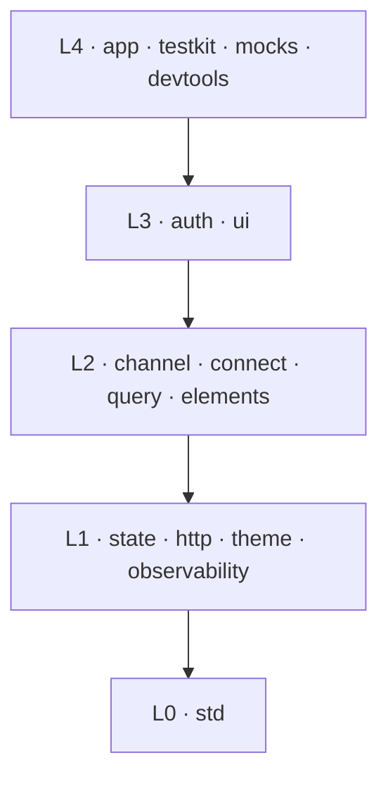

# plainworks

> A foundational, **host-independent** React and TypeScript kit with runtime-neutral cores and optional client bindings.

## Run the showcase

plainworks is pre-release and is not published to npm. Run the workspace showcase to see the current packages work together through their public exports:

```sh
bun install
bun run --filter @plainworks/showcase dev
```

The showcase server-renders a task dashboard, hydrates it on the client, reads data through the query and HTTP packages, applies the theme before paint, and routes live events into state and cache updates.

A second reference host, [`@plainworks/next-host`](./apps/next-host), assembles the same packages under Next.js App Router and React Server Components. Two genuinely different hosts on one kit is the proof of host-independence.

## Choose a package

| Need | Package |
|---|---|
| Errors, results, guards, resilience, and shared contracts | [`@plainworks/std`](./packages/std) |
| Reactive state with optional React bindings | [`@plainworks/state`](./packages/state) |
| Typed HTTP requests and list-query serialization | [`@plainworks/http`](./packages/http) |
| Theme tokens, schemes, and runtime resolution | [`@plainworks/theme`](./packages/theme) |
| Structured logging, error reporting, and Web Vitals | [`@plainworks/observability`](./packages/observability) |
| SSE and WebSocket channels | [`@plainworks/channel`](./packages/channel) |
| Connect RPC clients and interceptors | [`@plainworks/connect`](./packages/connect) |
| TanStack Query factories and cache integration | [`@plainworks/query`](./packages/query) |
| Owned Base UI and shadcn atoms | [`@plainworks/elements`](./packages/elements) |
| Authentication and OIDC with PKCE | [`@plainworks/auth`](./packages/auth) |
| Forms, data, navigation, and feedback composites | [`@plainworks/ui`](./packages/ui) |
| Application composition | [`@plainworks/app`](./packages/app) |
| Shared test fakes and harnesses | [`@plainworks/testkit`](./packages/testkit) |
| Reusable MSW mock-building primitives | [`@plainworks/mocks`](./packages/mocks) |
| Development-only runtime inspector | [`@plainworks/devtools`](./packages/devtools) |

Each package exposes a neutral `.` entry. Packages with React or browser bindings expose them separately through `./client`.

## How the packages fit

Each package owns one concern and imports only from a **strictly lower layer**.



*Arrows show the only allowed `@plainworks/*` import direction.*

This structure keeps neutral code free from React, DOM, Node, and framework assumptions. Hosts inject capabilities that vary, including `fetch`, streaming transports, cryptography, and token storage. See [Architecture](./docs/architecture.md) for package placement, runtime rules, and enforced invariants.

## Design rules

- **Keep defaults replaceable.** Ship each capability behind a typed seam so a host can supply its own adapter.
- **Assume no host.** Use universal web value types directly and inject host-varying behavior.
- **Name one concern.** Use one plain word consistently. Keep `@plainworks/std` as the zero-dependency base.
- **Import downward.** Define cross-layer seams low and implement them higher.
- **Construct explicitly.** Use per-request factories and injected registries. Imports must not open handles, read environment state, or create global singletons.

Versioned npm exports are the primary distribution surface. `elements` and `ui` also generate local registry manifests for owned, editable component source.

## Develop the repository

```sh
bun install
bun run check-versions
bun run lint
bun run check-comments
bun run typecheck
bun run check-boundaries
bun run build
bun run test
bun run check-packaging
```

Use `bun run gen package` to scaffold a package from the golden template. Read [Contributing](./CONTRIBUTING.md) before changing code.

## Tooling

| Concern | Tool |
|---|---|
| Tasks and caching | Turborepo |
| Package generation | `@turbo/gen` |
| Build | tsdown |
| Lint and format | Biome |
| Boundaries and cycles | dependency-cruiser |
| Version synchronization | Sherif and Syncpack |
| Tests and coverage | Vitest |
| Releases | Changesets |

Dependency versions live in the Bun catalog in the root `package.json`. Workspace manifests reference `catalog:` so version checks can reject inline or divergent versions.

## License

[MIT](./LICENSE)
