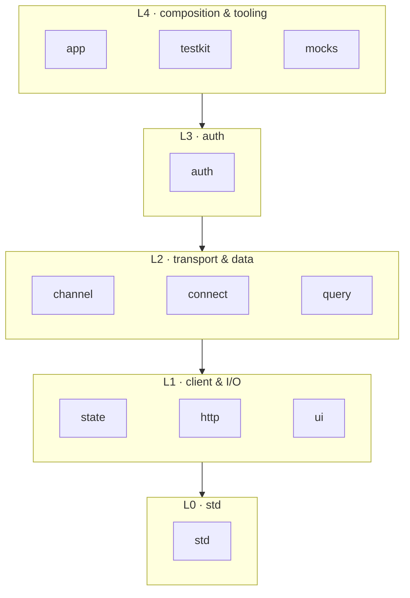

# plainworks

> A foundational, **host-independent** React/TypeScript kit — core capabilities plus pluggable
> seams, not a UI library with bolt-on packages.

plainworks gives you runtime-agnostic cores (no DOM/React/host assumptions) and thin, optional client bindings you opt into. Next.js, a Vite SPA, Astro, TanStack Start, Remix — or something that doesn't exist yet — all *plug in*. You keep your code simple; the seams stay replaceable.

> **Status: scaffold.** The workspace, boundary gate, package generator, and governance layer are in place, and the first packages have landed — `std` (L0), `state` (L1), `http` (L1), the L2 `channel` / `connect` / `query`, and the L4 `testkit`/`mocks`. Nothing is published to npm yet; the first release will ship on the `0.1.0-alpha.x` line under the `alpha` dist-tag (matching gokit/rskit), and until `0.1.0` APIs may change without back-compat.

## Design charter

- **Flexibility over opinionation.** Ship core capability + pluggable adapters. Defaults are swappable via a seam.
- **Assume no host — any web-standard runtime.** A package runs wherever its **runtime primitives** exist. Universal ones (`AbortController`) are used directly; non-universal ones (`fetch`, SSE/`WebSocket`, `crypto.subtle`, storage) are injected seams with a default. Every entry is neutral (`.`, no React/DOM — server, edge, workers, RSC, React Native) or a DOM client (`./client`, `"use client"` — browser, Electron). See [Axis 2](./docs/architecture.md#axis-2--host-independence).
- **One concern, one plain word, same word everywhere.** No `core`, `engine`, `foundation`, or junk-drawer `utils`. The bottom module is `@plainworks/std`.
- **Explicit acyclic layers**, enforced in CI (see below). Lower never imports higher; a cross-layer need defines the seam in the lower layer and implements it higher.
- **No import-time side effects, no module-level singletons.** Stores, clients, and sessions use per-request factories; adapters register explicitly.

## Layer map

Each package owns one concern, sits in a numbered layer, and imports only **downward**.



A package in `Ln` may import only `L<n`; sideways and upward imports fail CI. **dependency-cruiser** enforces it and points at the offending import. Full layer detail and the seam pattern live in [the architecture doc](./docs/architecture.md#layers).

## Two distribution axes

- **npm (versioned dep):** infrastructure you don't fork — `std`, the channel/auth/query engines, adapters, testkit. This repo.
- **registry (copy-in), later:** the *ownable* surface — UI, hooks, presets, templates. A parked, future deliverable.

## Quickstart (development)

```sh
bun install
bun run gen package        # scaffold a new package from the golden template
bun run check-versions && bun run lint && bun run typecheck \
  && bun run check-boundaries && bun run build && bun run test \
  && bun run check-packaging
```

## Governance

| Concern | Tool |
|---|---|
| Task runner / caching | Turborepo (`turbo`) |
| Package generator | `@turbo/gen` via `bun run gen` (golden template) |
| Build | tsdown — ESM-only, per-module `"use client"`, ships `dist` |
| Lint / format | Biome |
| Layer boundaries + cycles | dependency-cruiser (`@plainworks/boundaries`) |
| Version sync (single catalog) | Syncpack `catalog` policy (gate + fix) + Sherif (cross-package divergence) |
| Tests / coverage | Vitest |
| Releases | Changesets |

Versions are pinned in **one place** — the bun **catalog** in the root `package.json`. Every package references `catalog:` (peer ranges included); Syncpack's `catalog` policy fails CI if a package inlines a version, and Sherif fails CI on any cross-package version divergence.

## License

[MIT](./LICENSE)
