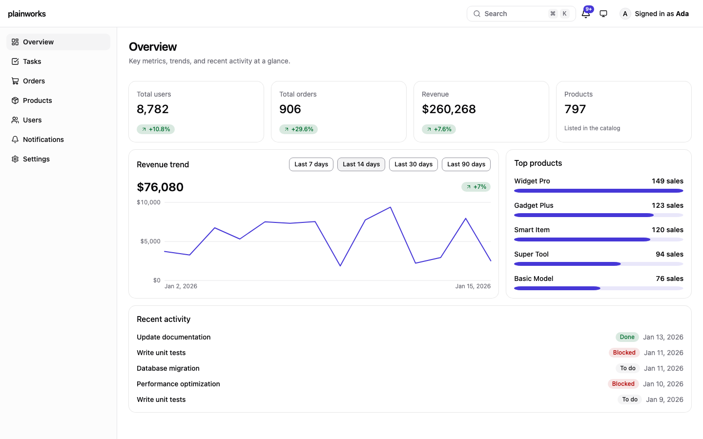
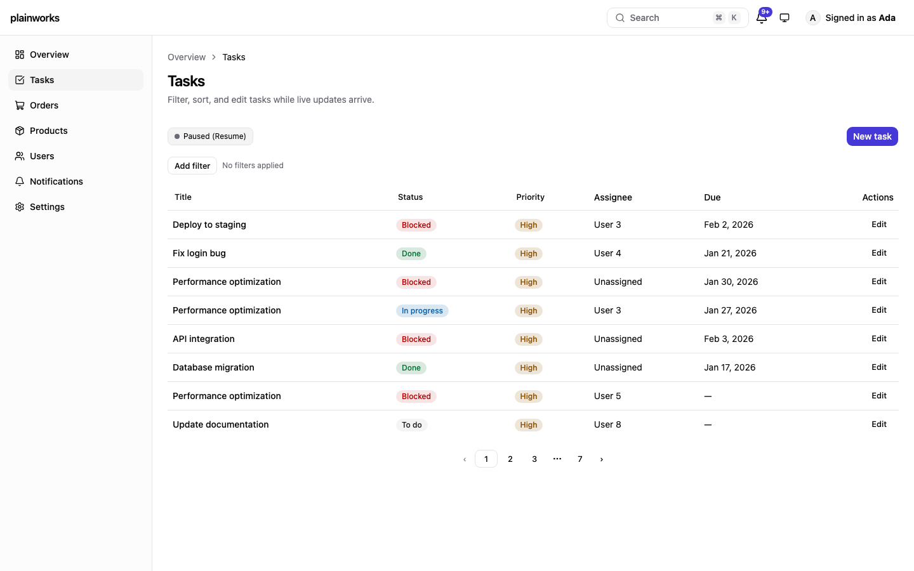
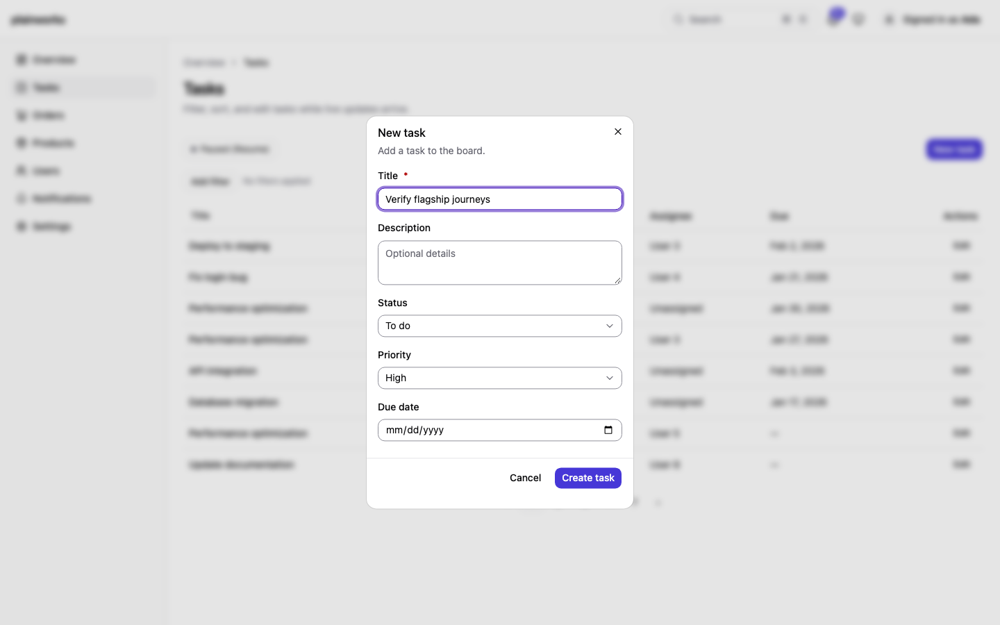
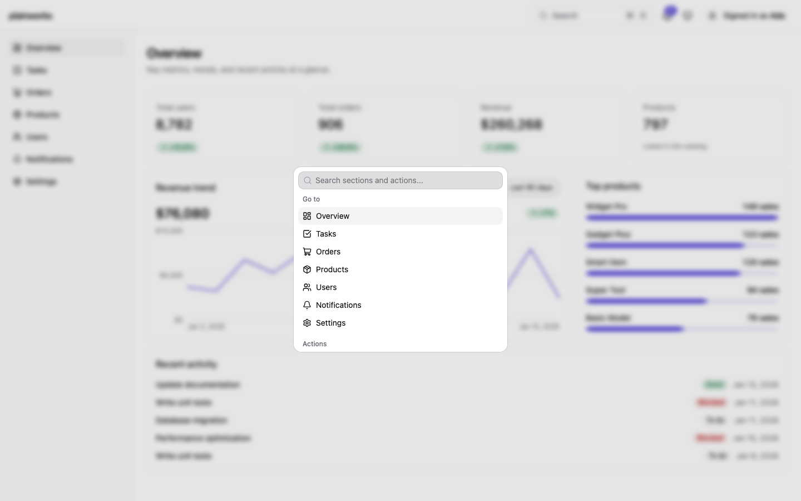
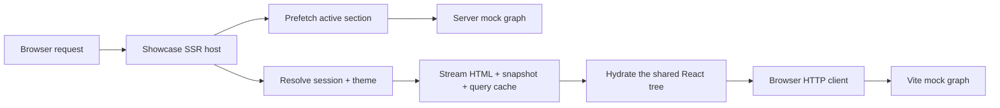

# Plainworks showcase

The showcase is a production-shaped dashboard assembled from the published `@plainworks/*` kit surfaces, wired to an in-repo demo backend (`@plainworks/demo`, private and never published) that stands in for a real API. Use it to see server rendering, hydrated data, authentication, theming, forms, optimistic mutations, live updates, accessibility, and responsive layout working together in one host.

## Run the app

```bash
bun install
bun run --filter @plainworks/showcase dev
```

Open `http://127.0.0.1:5173` and select **Sign in**. The development host runs an in-process identity provider and seeded mock APIs, so it needs no credentials or external services.

Try these flows:

- Press <kbd>⌘K</kbd> or <kbd>Ctrl+K</kbd> to navigate and run actions from the command palette.
- Create and edit a task, then pause or resume its live event stream.
- Filter the Orders, Products, and Users catalogs and open their detail views.
- Triage Notifications and watch the unread count update optimistically.
- Open Settings to edit validated forms and choose a mode, accent, and motion preference.
- Open **Plainworks inspector** (or press **⌘/Ctrl+Shift+D**) to inspect the HTTP timeline and query cache. Its app-owned **mock** tab controls failures, latency, fixture reset, and allowlisted probes. The diagnostics rail opens the same session at the relevant tab; production excludes the inspector, instrumentation, and styles through the Vite development gate.

## What it looks like

<picture>
  <source media="(prefers-color-scheme: dark)" srcset="docs/images/overview-dark.png">
  
</picture>

| Tasks board | New task dialog | Command palette |
|---|---|---|
| <picture><source media="(prefers-color-scheme: dark)" srcset="docs/images/tasks-board-dark.png"></picture> | <picture><source media="(prefers-color-scheme: dark)" srcset="docs/images/new-task-dark.png"></picture> | <picture><source media="(prefers-color-scheme: dark)" srcset="docs/images/command-palette-dark.png"></picture> |

*Generated by `ui:capture --docs` from the checkpoints marked `docs` in `e2e/flows/`. Rerun it when the UI changes.*

## How the host is assembled


```mermaid
flowchart LR
  request["Browser request"] --> server["Showcase SSR host"]
  server --> resolve["Resolve session + theme"]
  server --> prefetch["Prefetch active section"]
  prefetch --> serverMock["Server mock graph"]
  resolve --> html["Stream HTML + snapshot + query cache"]
  html --> hydrate["Hydrate the shared React tree"]
  hydrate --> browserApi["Browser HTTP client"]
  browserApi --> browserMock["Vite mock graph"]
```

*Server and browser use isolated seeded mock graphs with the same contracts, so rendering stays deterministic without sharing mutable state.*

| Capability | What the showcase proves |
|---|---|
| Composition | `createApp` resolves request-scoped capabilities; `AppProvider` rebuilds the client provider tree from the serialized snapshot. |
| Query | The active section is prefetched on the server and hydrated without an initial loading flash. Reads and optimistic writes use one request-scoped HTTP client and query cache. |
| Auth | A BFF session gate keeps tokens on the server. Login, logout, CSRF validation, and authorization run through published auth seams. A sign-in that can't finish returns to the login page with a notice. |
| Theme and state | Mode and accent are resolved before paint, then persisted through injected state sources. Device-local motion preferences use a versioned browser scope. |
| UI | Published elements and composites provide navigation, overlays, forms, tables, pagination, feedback, and display formatting. Route sections load lazily behind a shared shell. |
| Channel | Task events are validated and reconciled into the active query page, with explicit pause and teardown behavior. |
| Mocks | `@plainworks/demo` creates deterministic API graphs for SSR, browser development, unit tests, and browser tests. The browser graph also exposes the development-only control plane. |
| Devtools | HTTP, query, and an app-owned mock source share one session. The host has no operational logging pipeline or standalone store to inspect, and it does not manufacture clients just for diagnostics. The Next host adds the live channel to its inspector session. |

## Rendering flow

The server resolves the session and theme for each request, prefetches the active section, and streams the shared `<Showcase>` tree. The HTML carries one escaped JSON block, written by `renderHydrationScript`, with the application snapshot and dehydrated query cache. The browser validates it with `readHydration`, rebuilds per-app clients and sources, and hydrates the same tree.

Every section is a route-level lazy boundary. The persistent shell, command palette, toast host, and navigation load once; Overview, Tasks, Orders, Products, Users, Notifications, and Settings load on demand. Lists use bounded server pagination, so virtualization would add cost without improving the current data sizes.

## Development backend

The host constructs two isolated mock graphs from `createMockApi`: one intercepted by MSW for server-side reads and one served by Vite middleware for browser requests. They share seeded fixtures and wire behavior, not mutable stores. Browser mutations therefore remain isolated to the development API graph, while a fresh server process and every test begin deterministically.

Control routes under `/mock/*` drive the development inspector. They never carry credentials in URLs, are not part of the production build, and are mounted only by the development server.

## Quality gates

```bash
bun run --filter @plainworks/showcase test
bunx playwright install chromium
bun run --filter @plainworks/showcase e2e
bun run --filter @plainworks/showcase build
bun run check-production --filter=@plainworks/showcase
```

Vitest covers server rendering, hydration, query behavior, mutations, keyboard interactions, and the deterministic DOM accessibility floor. Playwright runs the [browser gate](../../docs/browser-gate.md): flows in `e2e/flows/` cover every page, overlay, dialog, and loading, error, or empty state, plus a component gallery, on desktop and mobile in light and dark, with axe, reflow, focus, and layout checks. The workspace-wide CI gates also run type checking, linting, comment formatting, boundary checks, and version checks.

## See a UI change

```bash
bun run --filter @plainworks/showcase ui:capture --flow create-task   # frames of one flow
bun run --filter @plainworks/showcase ui:host                        # optional: a warm, signed-in host
```

`ui:capture` replays the flows in `e2e/flows/` against a seeded, fixed-clock, signed-in host and writes a frame and an ARIA snapshot at every checkpoint under `.ui-artifacts/`, plus one contact sheet per checkpoint. Open them and look. Add `--base <snapshot|ref>` to also see what changed. `ui:capture --docs` regenerates the images at the top of this page into `docs/images/`. `ui:host` keeps a host running so each capture skips startup, and prints a Playwright MCP command for exploring the same app. See the [testkit guide](../../packages/testkit/README.md#the-ui-loop--uicapture) for the flags and exit codes.

## Project map

| Path | Responsibility |
|---|---|
| `src/neutral` | Host-neutral code with no React or DOM. One folder per domain (`tasks`, `orders`, `notifications`, `settings`, `auth`) holds its shape guards, validated writes, and authorization; `navigation` holds the route table. |
| `src/server` | Streaming server rendering, the HTML document, and request-boundary handling. |
| `src/client` | The React tree. `bootstrap` builds the root and its capabilities, `auth` holds the session and gates, `shell` holds the frame, `router.tsx` the in-app router, and each section has its own folder. |
| `e2e` | The browser gate: flows in `flows/` (run by `ui:capture`), functional specs at the top level, shared helpers in `support/`, and test-only pages in `fixtures/`. |
| `docs/images` | Screenshots for this README, written by `ui:capture --docs`. Don't edit them by hand. |
| `server.ts` | Development composition for authentication, SSR, Vite, and isolated demo mock graphs. |

The route tree stays app-local, the app consumes the published kit exports plus the private in-repo `@plainworks/demo` backend, and no package imports the showcase.
