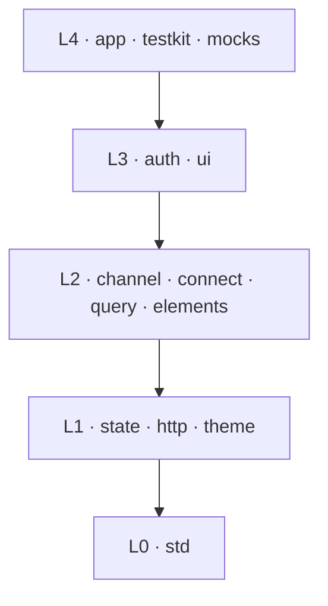
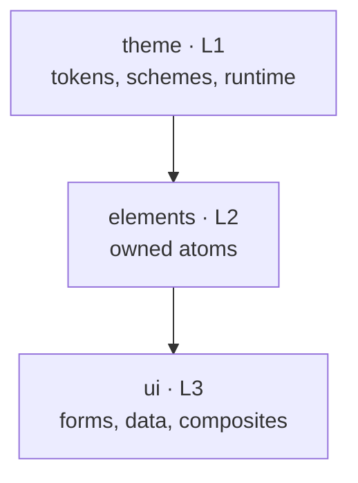
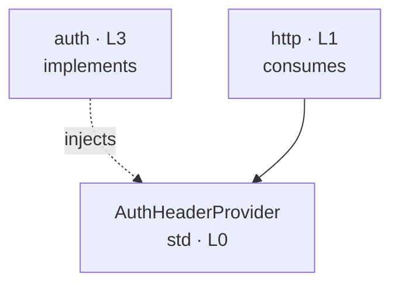
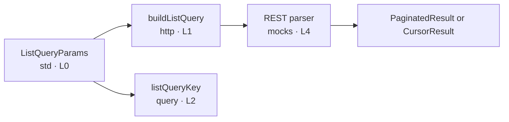

# plainworks architecture

Use this reference to decide **where code belongs**, **which hosts can run it**, and **which boundaries a change must preserve**.

## Place a change

1. Find the package that owns the concern.
2. Keep the package in its assigned layer.
3. Import only from a strictly lower layer.
4. Define a shared seam in the lowest consuming layer and implement it higher.
5. Put React or browser behavior behind `./client`; keep `.` neutral.



*Arrows show the only allowed `@plainworks/*` import direction.*

## Layer map

| Layer | Packages | Responsibility |
|---|---|---|
| **L0** | `std` | Errors, results, guards, resilience, shared seams, list contracts, and structural web types. No React. |
| **L1** | `state`, `http`, `theme` | Reactive state, typed HTTP, and the design-token substrate. |
| **L2** | `channel`, `connect`, `query`, `elements` | Streaming, RPC, TanStack Query integration, and owned UI atoms. |
| **L3** | `auth`, `ui` | Authentication, OIDC with PKCE, forms, data, navigation, and UI composites. |
| **L4** | `app`, `testkit`, `mocks` | Application composition, shared test tooling, and deterministic API fixtures. |

[`internal/boundaries/.dependency-cruiser.cjs`](../internal/boundaries/.dependency-cruiser.cjs) owns the authoritative `LAYERS` table. dependency-cruiser rejects upward imports, same-layer imports, cycles, and imports from packages missing from the table.

The workspace has three roots:

| Root | Purpose |
|---|---|
| `packages/*` | Published `@plainworks/*` packages generated from the golden template. |
| `apps/*` | Private consumers and examples. Route trees stay app-local. |
| `internal/*` | Development tooling and cross-package tests that are never published. |

Published packages ship ESM, set `"sideEffects": false`, expose a server-safe `.`, and add `./client` only when needed. Their manifests publish `dist` and keep React dependencies as catalog-managed peers.

## Choose an entry point

plainworks separates code by runtime requirement rather than framework.

| Entry | Runtime contract | Typical hosts |
|---|---|---|
| **Neutral `.`** | No React, DOM global, Node builtin, or framework assumption. | Node, Bun, Deno, edge runtimes, workers, React Server Components, and React Native with required polyfills. |
| **Client `./client`** | React bindings or browser behavior. Browser-only modules carry `"use client"`. | Browser SPAs, client components, and Electron renderers. |
| **Server `./server`** | Server-only behavior that must stay out of client graphs. | BFFs and server runtimes. |

React Native can use DOM-free hooks from packages such as `state`, `query`, `channel`, and `auth`. DOM UI and browser storage do not belong in its graph.

Workers inject SSE because they do not provide `EventSource`. Electron renderers use the DOM client entry but must keep BFF-managed tokens in memory rather than browser storage. React Native hosts inject missing cryptography, storage, or streaming primitives.

### Runtime primitives

Use standardized value primitives directly. Inject behavior that varies by host or must be replaced in tests.

| Kind | Rule | Examples |
|---|---|---|
| **Universal value** | Use directly. | `AbortController`, `AbortSignal`, `Headers`, `URL`, `URLSearchParams`, `Response`, `TextDecoder` |
| **Host-varying behavior** | Accept through an injected seam with a platform default. | `fetch`, SSE, `WebSocket`, `crypto.subtle`, token storage |

The shared ES2023 compile configuration includes no DOM or Node libraries. `types/universal-web.d.ts` declares the supported universal surface, and `@plainworks/std/web` provides structural public types. A neutral module that names `document`, `window`, `localStorage`, `navigator`, `EventSource`, or a Node builtin fails typecheck. Fixtures in `@plainworks/boundaries` prove this gate.

The neutral entry already gives React Server Components a server-safe build, so packages do not need a duplicate `react-server` export condition.

## Distribution

Published packages use standard npm exports. `elements` and `ui` also derive local `registry.json` authoring manifests from their source files so components can remain owned and editable.

| Surface | Use |
|---|---|
| **npm package** | Import versioned infrastructure and UI packages through their public exports. |
| **Registry manifest** | Describe owned `elements` and `ui` source for component authoring. |

## Naming and structure

Each package owns **one concern with one plain-word name**. Do not create packages or folders named `core`, `engine`, `foundation`, `utils`, `helpers`, or `misc`.

A concern that spans several modules uses a concern-named folder with a re-export-only `index.ts`. A single-module concern stays in a clearly named file. Paths and exports qualify ambiguous verbs, such as `pipeline/interceptor.ts` with `composeInterceptors`.

`@plainworks/std` is the zero-dependency base. Move a concern into its own package when it has a distinct responsibility rather than turning `std` into a catch-all.

## UI package family

The UI packages share one design substrate and split by dependency weight.



*UI dependencies flow from the theme substrate toward higher-level components.*

`theme` owns token roles, color schemes, theme resolution, `styles.css`, and `cn`. `elements` owns the Base UI and shadcn atoms. `ui` composes those atoms into forms, data surfaces, navigation, overlays, and feedback.

Create a separate UI package only for a **leaf concern** that has heavy, independent dependencies and is not imported by another UI-family package. Keep interdependent concerns inside `ui` so the boundary gate can enforce one direction.

Inside `ui`, concerns follow a second downward-only order: **foundation → general → forms → data**. `data` may use `forms`; `forms` may not import `data`. Shared pieces move to a lower concern instead of creating a back-edge. The boundary configuration enforces this order.

`elements` ingests atoms through its registry commands. `registry add` and `registry update` run shadcn, rewrite shared imports to `@plainworks/theme`, add `"use client"` where required, and format the owned source. `registry diff` is advisory. `registry validate` checks the derived manifest offline. Code generation derives `registry.json`, package exports, and tsdown entries from the atom files, so edit the manifest source rather than generated files.

Consumers import atoms through per-component exports such as `@plainworks/elements/button`.

## Composition rules

### Define seams low

When packages in different layers share a capability, define the contract in the lowest layer that consumes it. Higher layers implement or inject that contract.



*The packages meet through a lower-layer contract, not a cross-layer import.*

The same rule applies to event shapes, stream transports, state sources, and other host capabilities.

### Inject components at the call site

React components are not neutral data seams. Pass component-valued extensions, such as links, icons, image loaders, or controls, at the call site with their data. For example, a breadcrumb accepts a host-provided `render` function and defaults to a plain anchor. Do not route components through a lower-layer seam or an upward registry lookup.

### Keep construction explicit

Imports must not read environment state, open handles, or dial a network. Create stores, clients, sessions, and registries per request through factories. Register adapters explicitly through an injected registry or `createX({...})`; do not use global mutable registries or string service locators.

## Security and UI invariants

| Invariant | Required behavior |
|---|---|
| **Authentication** | Send credentials in headers or secure `__Host-` cookies. Never put tokens in URLs, `localStorage`, or `sessionStorage`. Keep server token custody outside client graphs. |
| **OIDC** | Use Authorization Code with PKCE `S256`. Reject insecure algorithms and validate redirects and state. |
| **Errors** | Expose typed, actionable errors that preserve causes. Never throw strings, swallow failures, or return success-shaped fallbacks. |
| **Async ownership** | Give streams, subscriptions, timers, queues, and abort controllers explicit cancellation and teardown. Bound buffers and retries. |
| **Accessibility** | Interactive client code meets WCAG 2.2 AA, supports keyboard and visible focus, uses 24×24 CSS-pixel targets, and includes an axe assertion. |
| **Responsive UI** | Use fluid, mobile-first layouts, container queries, and reduced-motion and color-scheme preferences. Avoid fixed-size traps. |
| **Packaging** | Ship ESM-only `dist`, correct exports and types, and no committed build output. |

## Testing

| Scope | What runs | External edges | Location |
|---|---|---|---|
| **Unit** | One package or concern | Shared fakes from `@plainworks/testkit` | Package `src/**/*.test.ts` files |
| **Integration** | Built public exports from several packages | MSW or in-memory doubles | [`internal/integration`](../internal/integration) |

Unit tests assert behavior with deterministic clocks, seeded randomness, and no real network or filesystem. React tests query by role or label, use `user-event`, and assert accessibility. Integration tests run against built package exports so they exercise what a consumer installs.

Cross-package tests live outside published packages because a lower package cannot import higher-layer fixtures. The boundary gate prevents packages from importing `apps/` or `internal/`.

### List request flow

The list capability separates an abstract request from its REST encoding and cache identity.



*One abstract request drives the REST wire and a transport-independent cache key.*

`std` owns `ListQueryParams`, filters, operators, and response envelopes without URL tokens. `http` owns the REST operator tokens, escaping, parsing, and `buildListQuery`. `mocks` reuses that HTTP dialect to parse requests. `query` derives cache keys from the abstract parameters and re-exports the list types as the consumer facade.

The integration suite verifies serialization, offset and cursor paging, cache keys, empty results, aborts, and typed server failures across these packages.

## Repository governance

| Concern | Tool or rule |
|---|---|
| Tasks and caching | Turborepo |
| Package generation | `@turbo/gen` through `bun run gen` |
| Build | tsdown, ESM-only |
| Lint and format | Biome |
| Boundaries and cycles | dependency-cruiser |
| Packaging | publint and are-the-types-wrong |
| Portability | ES2023-only typecheck and boundary fixtures |
| Version synchronization | Syncpack and Sherif against one Bun catalog |
| Tests and coverage | Vitest; 80% per package and 85% for security-critical packages |
| Releases | Changesets and npm trusted publishing with provenance |

Every dependency version lives in the root Bun catalog. Package manifests use `catalog:` so Syncpack and Sherif can reject inline or divergent versions.

### TypeScript 6 boundary

The catalog pins TypeScript to `^6.0.3` because dependency-cruiser requires the JavaScript Compiler API. TypeScript 7 does not provide that API. Raising the catalog to TypeScript 7 would stop dependency-cruiser from extracting imports and silently disable the layer gate.

`@plainworks/boundaries` tests enforce the TypeScript 6 line. Do not raise the catalog past TypeScript 6 unless the boundary package first receives a compiler implementation that can still extract and validate imports.

## Definition of Done

Run all gates from the repository root:

```sh
bun run check-versions
bun run lint
bun run check-comments
bun run typecheck
bun run check-boundaries
bun run build
bun run test
bun run check-packaging
```
