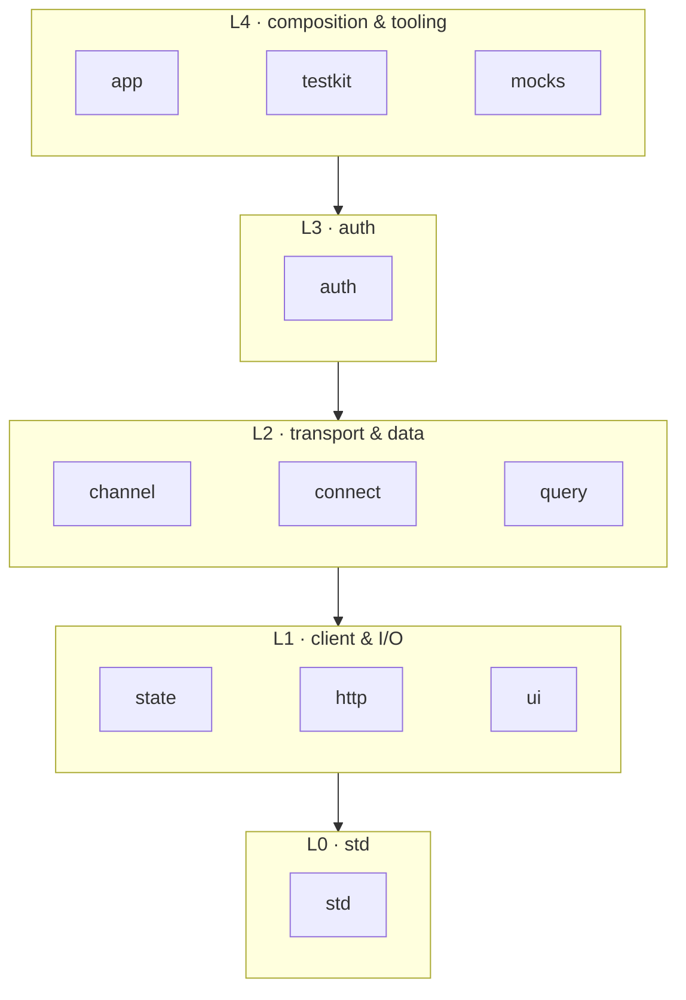
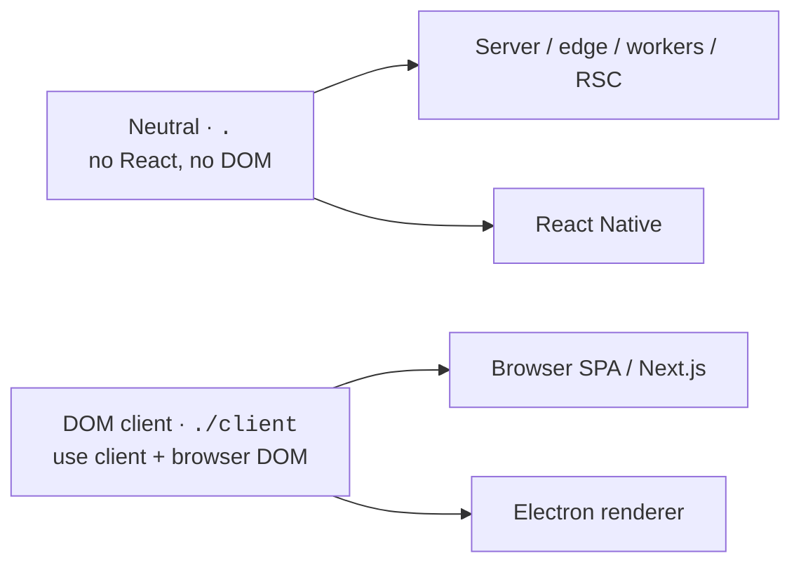
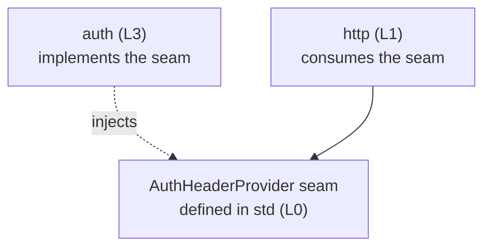
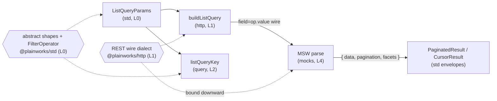

# plainworks architecture

This is the canonical reference for how plainworks is organized: its **naming**, its **layers**, the **two axes** every package is placed against, and the **invariants** the gates enforce. Read it once to understand the shape; come back to it when a change needs to know where it belongs.

## At a glance

plainworks is a stack of small packages. Each one owns a single concern, sits in a numbered layer, and may only depend **downward**.

*Arrows are the only allowed import direction — a package never imports its own layer or above.*

Two independent questions decide where each package lives and how it ships:

- **How does a consumer get the code?** — the *distribution* axis.
- **Where can the code run?** — the *host-independence* axis.

## Axis 1 — Distribution

How a consumer takes the code. Two modes, and only the first is built today.

| Mode | What it covers | Consumer relationship | Status |
|---|---|---|---|
| **npm** (versioned dependency) | Infrastructure you don't fork: `std`, the channel/auth/query engines, adapters, `testkit`. | Import it, upgrade it via semver. | **This repo.** |
| **registry** (copy-in) | The *ownable* surface: UI, hooks, presets, templates — a shadcn-style copy-in for complex components. | You paste it in, then own and edit it. | **Parked** — a later deliverable, not part of the foundation. |

## Axis 2 — Host-independence

Where the code can run. The kit **assumes no host** — Next.js, a Vite SPA, Astro, TanStack Start, Remix, Electron, React Native, or a runtime that doesn't exist yet all *plug in*.

The precise promise is narrower and more honest than "runs anywhere": a package runs anywhere its **runtime primitives** exist. Everything is written against the web platform (`fetch`, `AbortController`, `WebSocket`, Streams, Web Crypto), never against a framework.

### The primitive contract

A package sorts every platform primitive it needs into one of two tiers.

| Tier | Rule | Examples |
|---|---|---|
| **Universal** | Present on every target (Node, Deno, Bun, browsers, edge, workers, React Native) as a pure, deterministic value type. Use it directly. | `AbortController`/`AbortSignal`, `Headers`, `URL`/`URLSearchParams`, `Response`, `TextDecoder` (the WHATWG value types the shim binds) |
| **Non-universal** | Has real host variance, or needs test substitution. Take it through an **injected seam** with a platform default — never a hard import. | `fetch`, SSE / `WebSocket`, `crypto.subtle`, token storage |

This is the same rule the layer map uses for packages — *define the seam, inject the implementation* — pointed at the platform instead. A host that has the primitive gets the default for free; a host that lacks it supplies its own. The reference implementation already ships: `http` takes its `fetch` as `options.fetch`.

### Three environment buckets

Every entry point falls into exactly one bucket. The old "server vs client" split hid a third case — React that runs without a DOM.

1. **Neutral (`.`)** — no React, no DOM. The default import and the widest target: server, edge, workers, RSC, and inside React Native.
2. **DOM client (`./client`)** — React plus browser DOM, marked per-module with `"use client"`. Browser SPAs, Next.js client components, the Electron renderer. `ui` and anything touching `document` or CSS lives here.
3. **React-without-DOM** — React Native and Expo: React renders, but there is no DOM, no cookies, and Web Crypto needs a polyfill. DOM `ui` is out of scope here, but the *hooks* in `state`, `query`, `channel`, and `auth` stay DOM-free so RN can still use them.

### Where each runtime lands

| Runtime | Neutral `.` | DOM `./client` | Note |
|---|:---:|:---:|---|
| Node · Deno · Bun | ✅ | — | server & tooling |
| Edge · Web / Service Workers | ✅ | — | no `EventSource` in workers → SSE seam |
| Browser SPA · Next.js client | ✅ | ✅ | full DOM |
| **Electron** | ✅ | ✅ | Chromium + Node; BFF cookie ⇒ in-memory auth adapter |
| **React Native · Expo** | ✅ (with polyfills) | ❌ | inject crypto + storage + SSE; DOM `ui` out of scope |

### How it's enforced

Two boundaries keep the promise from decaying into a convention:

- **Server/client split** — a server-only module (especially auth token custody) is never pulled into a `"use client"` graph. Enforced at build and in review.
- **Portability gate** — the neutral `.` entry may reference no DOM global (`document`, `window`, `localStorage`, `navigator`, `EventSource`) and no Node builtin. This is enforced at compile time, not by a lint heuristic: the shared **ES2023-only** config (`tsconfig.base.json` — no DOM/Node lib, `types: []`) plus the explicit `types/universal-web.d.ts` shim means any host-only name is simply undeclared and fails `typecheck`, and fixtures in `@plainworks/boundaries` prove the gate rejects a DOM global while accepting a universal-only entry. The web-platform surface a neutral entry *does* name in its public API (`fetch`, `Headers`, `Response`, `URL`) is typed against the self-contained structural `Web*` types owned by `std` (`std/web`), not the DOM or `@types/node` libs — so a shipped `.d.ts` typechecks standalone against the ES lib and a consumer is never forced to install host type libs to use the kit.

### Why no `react-server` export condition

The `react-server` condition exists to point an RSC bundler at a *different* build than the client one — the escape hatch for a package whose main entry contains `"use client"` or client-only code. plainworks does not have that problem: the neutral `.` entry is server-safe *by construction* (the portability gate above forbids any client/DOM global in it), and every client binding lives behind the explicit `./client` entry. An RSC graph importing `.` already resolves to the correct server-safe module, so a `react-server` condition would only ever point at the same file as `import` — config with no behavioral effect and a standing maintenance cost. It is deliberately omitted; add it only if a package ever ships a genuinely divergent server build.

## Naming

One concern, one plain word, the **same word everywhere**. Names like `core`, `engine`, `foundation`, and junk-drawer `utils` are banned.

The bottom of the stack is **`std`** (`@plainworks/std`) — a charter-guarded, zero-dependency, host-independent standard library. Anything with a real concern of its own graduates to its own one-word package.

## Layers

Each package sits in a numbered layer and may import `@plainworks` packages only from a **strictly lower** one. Sideways and upward imports are forbidden.

| Layer | Packages | Concern |
|---|---|---|
| **L0** | `std` | Errors, result, guards, contracts (seams incl. Standard Schema validation), resilience, structural web-platform types. No React. |
| **L1** | `state` · `http` · `ui` | Client state, the typed fetch client, components. |
| **L2** | `channel` · `connect` · `query` | Streaming transport, RPC, TanStack wiring. |
| **L3** | `auth` | Core plus `oidc` / `jwt` / `apikey` / BYO adapters; server/client split. |
| **L4** | `app` · `testkit` · `mocks` | Composition, providers, harnesses, test tooling. |

### Seams point down, implementations live up

When a higher layer needs to plug into a lower one, the **seam is defined in the lower layer and implemented higher**. The `AuthHeaderProvider` seam and the event shapes live once in `std`; `channel` and `auth` implement against them. No package reaches across a boundary, and no seam is copied twice to drift apart.

*The contract lives at the bottom; the two ends meet at composition, not through a cross-layer import.*

### Enforcement

**dependency-cruiser**, isolated in [`@plainworks/boundaries`](../internal/boundaries), encodes the map from a single `LAYERS` table ([`.dependency-cruiser.cjs`](../internal/boundaries/.dependency-cruiser.cjs)) and fails CI on any upward or sideways import or cycle, naming the offending file and rule. The gate **fails closed**: a package absent from `LAYERS` may import nothing, so it can never go vacuously green. A fixture-backed test proves the gate actually rejects a bad import.

## Invariants

Every package holds to these; review and the gates check them.

| Invariant | What it means |
|---|---|
| **No import-time side effects** | Importing a module never dials the network or reads env. Adapters register via an explicit `register()` / `createX({...})`. |
| **No module-level singletons** | Stores, clients, and sessions come from per-request factories, so they are SSR/RSC-safe. |
| **Explicit adapter registration** | Adapters go into an injected registry — no global registry, no string-based service locator. |
| **Header-only auth** | A token never rides in a URL or query string. |
| **Runtime primitive contract** | Universal primitives used directly; non-universal ones injected as seams; the neutral `.` entry stays DOM- and Node-builtin-free. |
| **Typed errors, no `any`** | Errors are typed values, never thrown strings; public APIs expose no `any`. |
| **Accessible & responsive by default** | Interactive `./client` code meets WCAG 2.2 AA, is mobile-first and fluid, honors `prefers-reduced-motion` / `prefers-color-scheme`, and carries an axe assertion per component. |
| **ESM-only, real `dist`** | Correct `exports` / `types` / `files`; each package ships a tsdown `dist`; `typecheck` is separate from `build`. The `check-packaging` gate (**publint** + **are-the-types-wrong**) validates each built tarball's `exports`/`types` resolution. |

## Testing

Tests fall into three deliberate layers. The line between them is *what is faked*, not how much code runs.

| Layer | What is assembled | Fakes / doubles | Home |
|---|---|---|---|
| **Unit** | One module's pure logic | `@plainworks/testkit` fakes (`fakeFetch`, fake transports) | Each package's `src/**/*.test.ts` |
| **Integration** | Real `@plainworks/*` packages wired together | Edges faked — the **MSW** mock service (`@plainworks/mocks`, `onUnhandledRequest: "error"`), in-memory doubles | `internal/integration` |
| **e2e** | An assembled surface with nothing faked | None — a real browser/server/DB | *reserved* (a future `internal/e2e`) |

Unit tests stay on `testkit` fakes — mocking the network at the socket for a single-module test would only slow it down. The **integration** layer is where the kit proves it speaks the same wire a consumer's backend does, so it runs against the MSW mock service through its real `fetch` boundary. **Depth** — smoke (shallow "does it run") through thorough — is a property of an individual test, captured in its filename, not a separate folder.

### Why a separate home

An integration test assembles several `@plainworks/*` packages at once — `http` builds the request, `mocks` (L4) answers it, `query` derives the cache key. A test *inside* `packages/http` can't import `mocks`: that is an upward L1→L4 import the boundary gate rejects. So cross-package tests live in [`internal/integration`](../internal/integration), a dev-only workspace that depends **downward** on the published surfaces; the `no-package-into-apps-or-internal` boundary rule keeps every published package from importing it, so the cross-package tests can never leak into the shipped graph. It compiles and runs against each dependency's built `dist`, so it exercises exactly what a consumer installs. Inside it, tests are organized **by concern folder, one scenario per file** — no `test/`/`smoke/` sub-layer, since the whole package is integration by scope.

### The list wire: one abstract contract, per-transport dialects

The PostgREST/Supabase-style list read splits by concern across three homes, so each transport can serialize the **same** abstract request its own way:

- **The abstract contract** — the typed request (`ListQueryParams`, `ListFilter` and variants), the response envelopes (`PageInfo`, `PaginatedResult`, `CursorResult`, `Facets`), and the operator **vocabulary** `FilterOperator` (the operator *names* as a concept) — is defined **once** in `@plainworks/std` (L0, the lowest common layer of its consumers). It carries no URL or wire token.
- **The REST wire dialect** — the operator→token map, the longest-first token ordering, the token resolvers, and the value escape/parse codec — lives in `@plainworks/http` (L1), paired with the serializer `buildListQuery`. The `mocks` REST backend (L4) binds **downward** to `@plainworks/http/list` to parse that same dialect, so serializer and parser read one codec and can't drift. A future `connect`/`graphql` transport serializes the same `std` params differently and owns its own keys.
- **The cache keys** — `query` (L2) derives `listQueryKey`/`infiniteListQueryKey` from the abstract `ListQueryParams` alone; it never touches a wire token. A `query` consumer imports the list **types** from `@plainworks/query` (the facade).

The offset envelope is typechecked against `PageInfo` on both the mock and the consumer, so a renamed field is a compile error. The integration list suite ([`internal/integration/list`](../internal/integration/list)) rides this end-to-end — `buildListQuery(params)` → MSW parse in `mocks` → `PaginatedResult<T>` / `CursorResult<T>` decode → deterministic `listQueryKey` — with one scenario file per behavior (wire serialization, cache keys, offset and cursor paging, aborts, empty pages).

## Governance

| Concern | Tool |
|---|---|
| Task runner / caching | Turborepo |
| Package generator | `@turbo/gen` via `bun run gen` (golden template; CI regenerates and re-gates the output) |
| Build | tsdown (ESM-only, per-module `"use client"`, ships `dist`) |
| Lint / format | Biome |
| Layer boundaries + cycles | dependency-cruiser (in `@plainworks/boundaries`) |
| Packaging validation | publint + are-the-types-wrong (`@arethetypeswrong/cli`) over each built tarball, via `bun run check-packaging` |
| Runtime primitive contract | ES2023-only compile config (no DOM/Node lib) + `types/universal-web.d.ts` shim, enforced at `typecheck`; portability fixtures in `@plainworks/boundaries` |
| Version sync | Syncpack (`catalog` policy) + Sherif (cross-package divergence) |
| Tests / coverage | Vitest — ≥ 80% per package, ≥ 85% for security-critical packages like `auth` |
| Releases | Changesets; published with npm provenance (SLSA attestation) via trusted publishing |

### One version list

Dependency versions are pinned in **one place** — the bun **catalog** in the root `package.json`. Every package references `catalog:` instead of an inline version, peer ranges included. Syncpack fails CI if a package inlines a version or names a dependency missing from the catalog, and Sherif flags any dependency that resolves to different versions across packages.

### TypeScript: 6 now, 7 later

The catalog pins **`typescript` at `^6.0.3`** on purpose. TypeScript 7 (the native Go `tsgo` compiler) does not yet ship a JavaScript Compiler API, so the TS-AST tooling this repo depends on — **dependency-cruiser**, the boundary and cycle gate — cannot run on it. Bumping to 7 would make dependency-cruiser silently stop reading imports and **disable the layer gate** instead of failing loudly. A test in `@plainworks/boundaries` asserts the catalog stays on the 6 line and fails CI the moment someone raises it.

The migration is pre-wired to be a one-file flip. dependency-cruiser is the only consumer of the TS Compiler API and is isolated in `@plainworks/boundaries` with its own `typescript` dependency. When the Compiler API lands on TS7, alias `typescript` → `@typescript/typescript6` in that one package and relax the guard — no other package moves. Until then, **do not raise the catalog `typescript` past 6** without re-homing the gate first.
