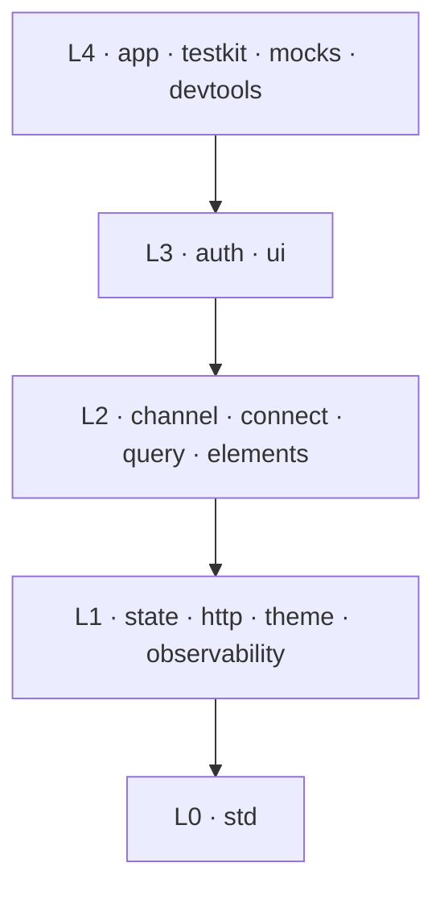
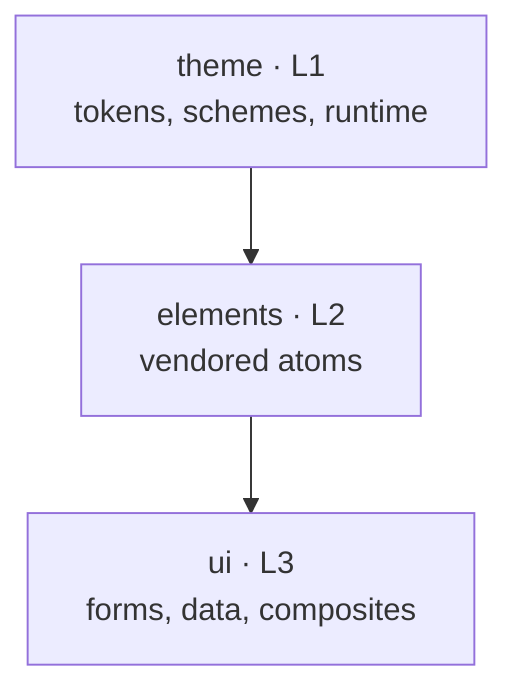
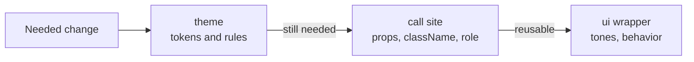
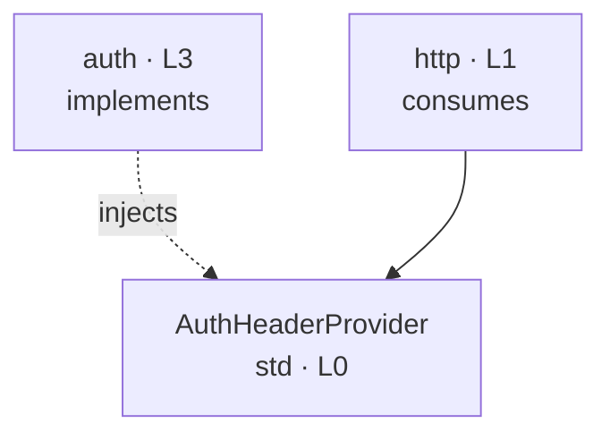
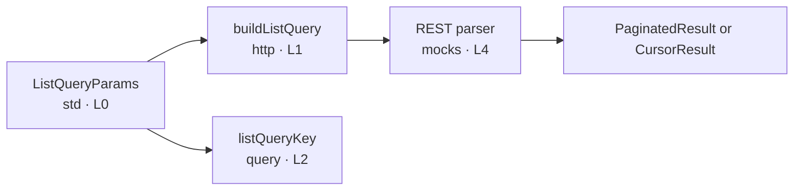

# plainworks architecture

Use this reference to decide **where code belongs**, **which hosts can run it**, and **which boundaries a change must preserve**. The settled design choices behind these rules are recorded in [`adr/`](./adr).

## Place a change

1. Find the package that owns the concern.
2. Keep the package in its assigned layer.
3. Import only from a strictly lower layer.
4. Define a shared seam in the lowest consuming layer and implement it higher.
5. Keep `.` neutral. Put React bindings behind `./client` and browser behavior on a named adapter subpath.

<!-- layer-map:diagram -->

```mermaid
flowchart TD
  L4["L4 · app · testkit · mocks · devtools"] --> L3["L3 · auth · ui"]
  L3 --> L2["L2 · channel · connect · query · elements"]
  L2 --> L1["L1 · state · http · theme · observability"]
  L1 --> L0["L0 · std"]
```

*Arrows show the only allowed `@plainworks/*` import direction.*
<!-- /layer-map:diagram -->

## Layer map

<!-- layer-map:table -->
| Layer | Packages | Responsibility |
|---|---|---|
| **L0** | `std` | Errors, results, guards, resilience, shared seams, list contracts, and structural web types. No React. |
| **L1** | `state`, `http`, `theme`, `observability` | Reactive state, typed HTTP, the design-token substrate, and logging, error reporting, telemetry, and Web Vitals. |
| **L2** | `channel`, `connect`, `query`, `elements` | Streaming, RPC, TanStack Query integration, and vendored UI atoms. |
| **L3** | `auth`, `ui` | Authentication, OIDC with PKCE, forms, data, navigation, and UI composites. |
| **L4** | `app`, `testkit`, `mocks`, `devtools` | Application composition, shared test tooling, reusable MSW mock-building primitives, and the development-only runtime inspector. |
<!-- /layer-map:table -->

[`internal/boundaries/layers.json`](../internal/boundaries/layers.json) is the single source of this map. The diagram and table here, in the README, and in the contributor instructions are generated from it with `bun run sync-layer-map`, and `bun run verify` fails when they drift. dependency-cruiser reads the same file and rejects upward imports, same-layer imports, cycles, and imports from packages missing from the map.

The workspace has three roots and four generated profiles. `bun run check-shape` verifies them, and `bun run sync-shape` rewrites the derived manifest fields.

| Profile | Workspaces | Contract |
|---|---|---|
| **package** | `packages/*` and built private packages such as `internal/demo` | A `tsdown.config.ts` build description drives `exports`, `files`, `sideEffects`, scripts, and preset dev dependencies. |
| **cli** | `create-plainworks` | A published command with a bin build and package checks. |
| **tool** | dev-only `internal/*` tools | Source lives under `src/`, tests are colocated, optional `src/cli.ts` exposes `plainworks-<dirname>` and runs Bun with the `@plainworks/source` condition (so a tool imports `@plainworks/*` from source with no build), and `tsconfig.json` extends `../../tsconfig.tool.json`. |
| **app** | `apps/*` and `internal/integration` | `tsconfig.json` extends `../../tsconfig.app.json`, tests use `appTestConfig`, and tasks resolve built package surfaces. |

Published packages ship ESM, expose a server-safe `.`, and add other [entries](#choose-an-entry-point) only when needed. Their manifests are generated from the typed `PackageBuild` description exported by `tsdown.config.ts`, and React dependencies stay catalog-managed peers.

The root tsconfigs mirror those profiles: `tsconfig.base.json` typechecks host-neutral packages, `tsconfig.tool.json` typechecks source-run internal tools with Node types, and `tsconfig.app.json` typechecks apps and integration suites against built package surfaces.

## Choose an entry point

plainworks separates code by runtime requirement rather than framework. Every package uses the same small set of entry kinds, so an import path tells you where the code can run.

| Entry | What it holds | Where it runs | Example |
|---|---|---|---|
| **`.`** | The package's everyday vocabulary. No React, DOM global, Node builtin, or framework. | Anywhere: Node, Bun, Deno, edge, workers, React Server Components, React Native. | `@plainworks/std` |
| **Concern subpath** | One concern of a package that holds several, named after its folder. | Same as `.`. | `@plainworks/std/time`, `@plainworks/http/list` |
| **`./client`** | React bindings. DOM-free unless the package declares `dom`. | React hosts, including React Native for DOM-free clients. | `@plainworks/state/client` |
| **`./server`** | Server-only code, such as token custody. It never enters a `"use client"` graph. | BFFs and server runtimes. | `@plainworks/auth/server` |
| **Adapter subpath** | One host-specific implementation of a seam, named after what it does. | Hosts that have that primitive. | `@plainworks/state/web-storage`, `@plainworks/auth/form-post` |
| **Component subpath** | One UI component or hook. | Browsers. | `@plainworks/ui/forms/text-field` |
| **Integration subpath** | Wiring to another plainworks package. | Wherever both packages run. | `@plainworks/app/capabilities/query`, `@plainworks/devtools/query` |
| **Asset** | A stylesheet or other file. | Bundlers. | `@plainworks/theme/styles.css` |
| **`./testing`** | Test-only helpers. Only tests may import them. | Test runners. | `@plainworks/app/testing` |

A few rules keep the vocabulary honest, and the gates enforce each one.

- **Named exports only.** A barrel lists every name it re-exports; `export *` fails lint. Each name has exactly one import path.
- **Everyday names in `.`, concerns on subpaths.** A package that spans several concerns keeps `.` for its prelude and puts each concern on its own subpath. Shared typed errors live in `src/errors/`; an error that belongs to one concern stays with it.
- **DOM is opt-in.** A package declares `dom: true` in `tsdown.config.ts` only when its product is browser UI (`theme`, `elements`, `ui`, `devtools`, `testkit`). Everywhere else the DOM lib is allowed only in adapter, test, and tooling projects.
- **Adapters say what they do.** An entry is never named after a host (`dom`, `browser`, `node`). The real-browser test harness is `testkit/playwright`, named after its required runner.
- **Test helpers stay out of shipped code.** `./testing` compiles in its own `tsconfig.testing.json` project, and a boundary rule stops production modules from importing it.

React Native imports `./client` from `state`, `http`, `query`, `channel`, `auth`, `connect`, and `app`. Those clients compile without the DOM lib, and fixtures in `@plainworks/boundaries` prove it. DOM UI and browser adapters stay out of its graph.

Workers inject SSE because they do not provide `EventSource`. Electron renderers use the browser entries but must keep BFF-managed tokens in memory rather than browser storage. React Native hosts inject missing cryptography, storage, or streaming primitives.

### Runtime primitives

Use standardized value primitives directly. Inject behavior that varies by host or must be replaced in tests.

| Kind | Rule | Examples |
|---|---|---|
| **Universal value** | Use directly. | `AbortController`, `AbortSignal`, `Headers`, `URL`, `URLSearchParams`, `Response`, `TextDecoder` |
| **Host-varying behavior** | Accept through an injected seam with a platform default. | `fetch`, SSE, `WebSocket`, `crypto.subtle`, token storage |

The shared ES2023 compile configuration includes no DOM or Node libraries. `types/universal-web.d.ts` declares the supported universal surface, and `@plainworks/std` provides the structural `Web*` public types. A neutral module that names `document`, `window`, `localStorage`, `navigator`, `EventSource`, or a Node builtin fails typecheck. Fixtures in `@plainworks/boundaries` prove this gate.

The neutral entry already gives React Server Components a server-safe build, so packages do not need a duplicate `react-server` export condition.

## Distribution

Published packages use standard npm exports. `elements` and `ui` also derive shadcn `registry.json` manifests from their source files, so an app can copy a component's source and own its copy.

| Surface | Use |
|---|---|
| **npm package** | Import versioned infrastructure and UI packages through their public exports. |
| **Registry manifest** | Let an app copy `elements` or `ui` source into its own tree. Inside this repo, `elements` atoms stay vendored and locked. |

Inside the monorepo, package exports include a private `"@plainworks/source"` condition before `types` and `default`. `tsconfig.base.json`, `@plainworks/vitest-config`, `@plainworks/boundaries`, and every tool bin (through `bun --conditions`) resolve that condition, so packages and tools typecheck, test, and run against source without a build first. Apps and `internal/integration` use `tsconfig.app.json` with no custom condition, so they resolve `dist` and prove the published surface. Vendored shadcn atoms resolve through `dist` only; the layer gate maps their subpaths back to source so it still checks every import of an atom.

`plainworks-release pack <dir> [--destination <dir>]` packs the same manifest npm publishes: catalog and workspace ranges are resolved, `publishConfig` is applied, and the published manifest carries no source condition. `plainworks-release check-packaging [dir]` runs `publint --strict` and are-the-types-wrong against that tarball. Packages publish `dist` plus `src` (tests excluded), with JavaScript and declaration source maps pointing at the TypeScript source.

## Naming and structure

Each package owns **one concern with one plain-word name**. Do not create packages or folders named `core`, `engine`, `foundation`, `utils`, `helpers`, or `misc`.

A concern that spans several modules uses a concern-named folder with a re-export-only `index.ts`. A single-module concern stays in a clearly named file. Paths and exports qualify ambiguous verbs, such as `pipeline/interceptor.ts` with `composeInterceptors`.

`@plainworks/std` is the zero-dependency base. Move a concern into its own package when it has a distinct responsibility rather than turning `std` into a catch-all.

## UI package family

The UI packages share one design substrate and split by dependency weight.


```mermaid
flowchart TD
  theme["theme · L1<br/>tokens, schemes, runtime"] --> elements["elements · L2<br/>vendored atoms"]
  elements --> ui["ui · L3<br/>forms, data, composites"]
```

*UI dependencies flow from the theme substrate toward higher-level components.*

`theme` owns token roles, color schemes, theme resolution, `styles.css`, and `cn`. `elements` ships the vendored Base UI and shadcn atoms. `ui` composes those atoms into forms, data surfaces, navigation, overlays, and feedback.

Create a separate UI package only for a **leaf concern** that has heavy, independent dependencies and is not imported by another UI-family package. Keep interdependent concerns inside `ui` so the boundary gate can enforce one direction.

Inside `ui`, concerns follow a second downward-only order: **foundation → general → forms → data**. `data` may use `forms`; `forms` may not import `data`. Shared pieces move to a lower concern instead of creating a back-edge. The boundary configuration enforces this order.

### Vendored atoms

`elements` has two folders, and a name lives in only one:

| Folder | Holds | Changed by |
|---|---|---|
| `src/shadcn/` | **Vendored** atoms: exact shadcn CLI output plus the compat transform (`cn` from `theme`, `"use client"`) and Biome safe fixes. | Only `registry:update` / `registry:add`. |
| `src/atoms/` | Primitives we write, such as the `sonner` Toaster. | Us, under the full lint and type rules. |

`shadcn.lock.json` **locks** the vendored atoms: the CLI version, the style, and a hash per atom. `registry:validate` runs in CI and fails on a hand edit, an unlocked atom, or a stale entry. `registry:codegen` derives `registry.json`, package exports, and tsdown entries from the files on disk.

An atom is never edited. A needed change follows the **deviation ladder** and stops at the lowest rung that fixes it:


```mermaid
flowchart LR
  need[Needed change] --> theme["theme<br/>tokens and rules"]
  theme -->|still needed| site["call site<br/>props, className, role"]
  site -->|reusable| wrapper["ui wrapper<br/>tones, behavior"]
```

*Fix color, contrast, focus, and radius in the theme; a one-off at the call site; a reusable tone or behavior in a `ui` wrapper. An upstream bug is fixed the same way and noted for upstream reporting.*

Consumers import atoms through per-component exports such as `@plainworks/elements/button`.

## Composition rules

### Define seams low

When packages in different layers share a capability, define the contract in the lowest layer that consumes it. Higher layers implement or inject that contract.


```mermaid
flowchart TD
  auth["auth · L3<br/>implements"] -. injects .-> seam["AuthHeaderProvider<br/>std · L0"]
  http["http · L1<br/>consumes"] --> seam
```

*The packages meet through a lower-layer contract, not a cross-layer import.*

The same rule applies to event shapes, stream transports, state sources, and other host capabilities. It also covers **siblings** that may not import each other: `observability` implements the `Telemetry` seam that `http` and `channel` report to, and `query` implements the `CacheInvalidator` seam that `connect` invalidates through.

### Inject components at the call site

React components are not neutral data seams. Pass component-valued extensions, such as links, icons, image loaders, or controls, at the call site with their data. For example, a breadcrumb accepts a host-provided `render` function and defaults to a plain anchor. Do not route components through a lower-layer seam or an upward registry lookup.

### Keep construction explicit

Imports must not read environment state, open handles, or dial a network. Create stores, clients, sessions, and registries per request through factories. Register adapters explicitly through an injected registry or `createX({...})`; do not use global mutable registries or string service locators.

## Security and UI invariants

### Development inspection

[`@plainworks/devtools`](../packages/devtools/README.md) is an optional L4 consumer of public lower-layer seams. Under its own build-time development gate, a host creates named sources beside its runtime instances and passes them to `mountDevtools`, which owns the session and releases it with the shell on `dispose`. `DevtoolsShell` is the path for a session the host owns. Both views use the same bounded, redacted protocol. Custom renderers stay at the React call site; app-owned mock controls never introduce a same-layer dependency from devtools to mocks.

The [showcase](../apps/showcase/README.md) proves a Vite-gated shell with HTTP/query adapters and a custom mock panel. The [Next host](../apps/next-host/README.md) proves client-only HTTP/query/channel inspection under RSC. Their production gate scans a source-mapped analysis build of emitted JavaScript and CSS, not just whether a launcher is visible. Cross-tab, server/RSC, extension, standalone, React Native rendering, auth inspection, and time travel remain outside embedded v1.

### Shared acceptance bar

| Invariant | Required behavior |
|---|---|
| **Authentication** | Send credentials in headers or secure `__Host-` cookies. Never put tokens in URLs, `localStorage`, or `sessionStorage`. Keep server token custody outside client graphs. |
| **OIDC** | Use Authorization Code with PKCE `S256`. Reject insecure algorithms and validate redirects and state. |
| **Errors** | Expose typed, actionable errors that preserve causes. Never throw strings, swallow failures, or return success-shaped fallbacks. |
| **Async ownership** | Give streams, subscriptions, timers, queues, and abort controllers explicit cancellation and teardown. Bound buffers and retries. |
| **Accessibility** | Interactive client code meets WCAG 2.2 AA, supports keyboard and visible focus, uses 24×24 CSS-pixel targets, and includes an axe assertion. |
| **Responsive UI** | Use fluid, mobile-first layouts, container queries, and reduced-motion and color-scheme preferences. Avoid fixed-size traps. |
| **Packaging** | Ship ESM-only `dist` plus source maps, correct generated exports and types, and no committed build output. |

## Testing

| Scope | What runs | External edges | Location |
|---|---|---|---|
| **Unit** | One package or concern | Shared fakes from `@plainworks/testkit` | Package `src/**/*.test.ts` files |
| **Integration** | Built public exports from several packages | MSW or in-memory doubles | [`internal/integration`](../internal/integration) |
| **Browser** | Each reference host in real Chromium: flows with axe, reflow, focus, and layout checks, and no screenshot baselines | The host's seeded mock backend and a fixed clock | App `e2e/` suites; see [Browser gate](./browser-gate.md) |

Unit tests assert behavior with deterministic clocks, seeded randomness, and no real network or filesystem. React tests query by role or label, use `user-event`, and assert accessibility. Integration tests run against built package exports so they exercise what a consumer installs.

Cross-package tests live outside published packages because a lower package cannot import higher-layer fixtures. The boundary gate prevents packages from importing `apps/` or `internal/`.

### List request flow

The list capability separates an abstract request from its REST encoding and cache identity.


```mermaid
flowchart LR
  params["ListQueryParams<br/>std · L0"] --> wire["buildListQuery<br/>http · L1"]
  wire --> mock["REST parser<br/>mocks · L4"]
  mock --> envelope["PaginatedResult or CursorResult"]
  params --> key["listQueryKey<br/>query · L2"]
```

*One abstract request drives the REST wire and a transport-independent cache key.*

`std` owns `ListQueryParams`, filters, operators, and response envelopes without URL tokens. `http` owns the REST operator tokens, escaping, parsing, and `buildListQuery`. `mocks` reuses that HTTP dialect to parse requests. `query` derives cache keys from the abstract parameters and re-exports the list types as the consumer facade.

The integration suite verifies serialization, offset and cursor paging, cache keys, empty results, aborts, and typed server failures across these packages.

## Repository governance

| Concern | Tool or rule |
|---|---|
| Tasks and caching | Turborepo |
| Package generation | `@turbo/gen` through `bun run gen` |
| Build | tsdown through `@plainworks/tsdown-config`, ESM-only |
| Lint and format | Biome |
| Boundaries and cycles | dependency-cruiser |
| Workspace shape | `plainworks-shape check` and `plainworks-shape sync` |
| Packaging | `plainworks-release check-packaging` with publint and are-the-types-wrong |
| Portability | ES2023-only typecheck and boundary fixtures |
| Version synchronization | Syncpack and Sherif against one Bun catalog |
| Tests and coverage | Vitest through `@plainworks/vitest-config`; 80% per package and 85% for security-critical packages |
| Releases | Changesets and npm trusted publishing with provenance |

Every dependency version lives in the root Bun catalog. Package manifests use `catalog:` so Syncpack and Sherif can reject inline or divergent versions.

### TypeScript 6 boundary

The catalog pins TypeScript to `^6.0.3` because dependency-cruiser requires the JavaScript Compiler API. TypeScript 7 does not provide that API. Raising the catalog to TypeScript 7 would stop dependency-cruiser from extracting imports and silently disable the layer gate.

`@plainworks/boundaries` tests enforce the TypeScript 6 line. Do not raise the catalog past TypeScript 6 unless the boundary package first receives a compiler implementation that can still extract and validate imports.

## Definition of Done

Run all gates from the repository root. `internal/verify` owns the gate list; CI and the release workflow call the same command:

```sh
bun run verify          # every gate, in order
bun run verify --list   # the gates and what each enforces
```

`verify` has 13 gates: versions, lint, comments, layer map, atom lock, workspace shape, axe coverage, typecheck, boundaries, build, test, packaging, and production-bundle checks.
