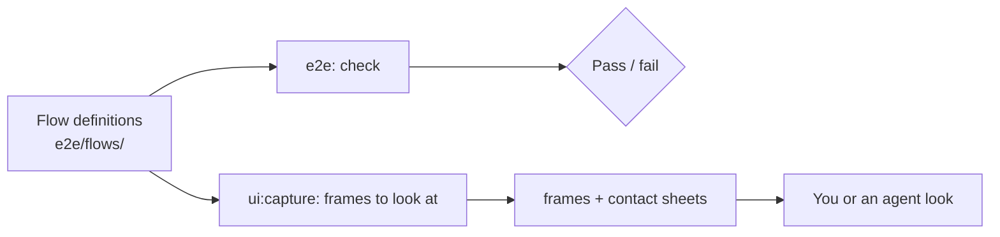

# Browser gate

The browser gate runs both reference hosts, the [showcase](../apps/showcase/README.md) and the [Next host](../apps/next-host/README.md), in real Chromium. Every test starts from seeded data and a fixed clock, and fails on any runtime error, hydration error, or request that leaves the host. The engine lives in [`@plainworks/testkit/playwright`](../packages/testkit/README.md#playwright-gate--plainworkstestkitplaywright).

## Quickstart

```bash
bunx turbo run build --filter=@plainworks/showcase^...   # the host's workspace dependencies
bunx playwright install chromium
bun run --filter @plainworks/showcase e2e                 # every flow and functional spec
```

Swap in `@plainworks/next-host` for the Next host. A failed test keeps its trace under the app's `test-results/`, and each failed checkpoint writes an evidence bundle under `.ui-artifacts/latest/`.

While you iterate, run only what you touched:

```bash
bun run --filter @plainworks/showcase e2e -- e2e/flows.spec.ts --grep "dialogs"   # one flow
bun run --filter @plainworks/showcase e2e -- e2e/journeys.spec.ts                 # one spec
```

To see what a change looks like, use [`ui:capture`](../packages/testkit/README.md#the-ui-loop--uicapture). It writes a frame at every checkpoint of the flows you name, for you or an agent to open and judge. `ui:capture --docs` refreshes the committed README screenshots from the checkpoints marked `docs`.

## The model



One set of flows feeds both uses: the e2e suite checks, and `ui:capture` shows.

Both modes wait for finite motion to settle before measuring a checkpoint. Assertions then compare settled layouts, so intended entrance motion is not a layout-shift failure. Chained motion is included; infinite spinners are ignored. Finite motion that cannot settle within 2 s fails readiness.

- **Flows are the gate.** A flow is a named journey of checkpoints: the pages, states, overlays, dialogs, and gallery fixtures of an app. `flows.spec.ts` asserts every flow at the `quick` preset (desktop and mobile, light and dark), and a flow may add devices such as `tablet`, `reflow` (320 px), or `landscape`.
- **Functional specs cover the rest.** A journey that needs its own assertions, such as a mutation that reconciles through the server, stays a plain spec. It imports the shared axe, focus, or reflow assertion from `@plainworks/testkit/playwright`.
- **No screenshot baselines.** Every check is structural, so nothing is compared with a committed image and any machine gives the same verdict.

## What each checkpoint checks

| Check | Rule |
|---|---|
| **Runtime errors** | Any page error, `console.error`, failed request, hydration warning, or off-origin request fails. A test that provokes one on purpose allows that exact message. |
| **Axe** | No WCAG 2.2 AA violation on the whole page. |
| **Reflow** | No horizontal scrolling, and every open dialog, drawer, or menu fits the viewport. |
| **Focus** | Opt-in per checkpoint. The focused control shows at least a 2 px indicator and is not covered. |
| **Hydration** | React has hydrated the `main` landmark. |
| **Layout heuristics** | Clipped text, overlapping targets, focusable content hidden under fixed chrome, broken images, and layout shift. |

A checkpoint that provokes a finding on purpose lists it in `allow`, with a reason.

## How it runs in parallel

Each Playwright worker starts **its own host** on its own port. Each test gets a fresh context, **resets first, then signs in** when configured. No saved cookie is reused against reset state. Workers never reset another worker's backend. CI runs one job per app.

| | Showcase | Next host |
|---|---|---|
| Workers (local / CI) | half the cores / 2 | a quarter of the cores / 1 |
| Ports | `5199 + n` | `5299 + n` |
| Per-worker isolation | its own Vite dependency cache | its own `.next/e2e-<port>` output |
| Warm-up at start | one page render | one request per route |

Set `E2E_BASE_PORT` to move the port range, and pass `--workers` to change the worker count. A worker refuses a port another server already answers on, so stop a stale dev server first. Both hosts stay dev servers, because the development inspector is part of what the gate proves.

`PLAINWORKS_GATE_ORIGIN` selects a warm/external host and requires exactly one worker. `ui:capture serve --explore` starts a separate host for signed-out MCP exploration; captures never reuse it or receive saved credentials. Give each port independent backend state.

## Real-system hosts

Use `gateHost.stop()` and `gateHost.restart()` in a flow that owns its process. Restart keeps the configured origin and chosen state paths; reset is a separate operation. A public flow omits `signIn`. Session suites reject supplied `storageState` and can set `gateSignIn: false` for a signed-out journey.

Readiness requires an exact status (200 by default) and the configured response predicate. Check run/build identity when the host publishes it. A redirect, 404, wrong protocol, occupied port, or early exit fails setup. Startup defaults to 30 s, each probe to 1 s, and graceful stop to 10 s; reference dev hosts explicitly allow 180 s for compilation. Cancellation still gets a fresh cleanup budget. Forced termination has 2 s to settle and raises `HostShutdownError`, never graceful success. Cleanup includes inherited process-group descendants; commands must not escape that group.

Startup continues to own the child while warming routes. Child exit cancels a pending warm request and fails setup even if that request returned successfully. Warming shares the startup deadline; the host is handed to the flow only after the final exit and cancellation check.

If the owning worker exits before fixture teardown, its exit hook force-kills the remaining group. This is emergency cleanup, not a graceful result. Normal teardown removes the hook after observing release. A `HostStartupError` with `retained: true` exposes `host.stop()` for a bounded cleanup retry.

For HTTPS, configure the origin and trust the runner's CA in both Node and Chromium. Set `NODE_EXTRA_CA_CERTS` before Node starts. Do not use TLS bypasses. The private system proof under `internal/integration/src/system/` uses a digest-pinned disposable Linux browser container, with CA keys and private state in tmpfs. It does not change macOS trust stores. Assertion mode and separate capture mode share the same public gate/flow surfaces; retained reports contain no browser traces or saved cookies. Each proof step runs as an owned command under its own deadline. Whether steps pass, fail, or time out, the runner then checks for leftover processes and listeners, removes the private state, and records every step's outcome in `cleanup.json`.

Run the isolated proof from the repository root:

```bash
docker build -f internal/integration/src/system/Dockerfile -t plainworks-system-proof:local .
mkdir -p internal/integration/.ui-artifacts
docker run --rm --init --network none --read-only \
  --cpus=2 --memory=4g --pids-limit=256 --user=1001:1001 \
  --ipc=private --shm-size=256m \
  --tmpfs /tmp:rw,nosuid,nodev,mode=1777 \
  --tmpfs /private:rw,nosuid,nodev,mode=0700,uid=1001,gid=1001 \
  --tmpfs /home/pwuser:rw,nosuid,nodev,mode=0700,uid=1001,gid=1001 \
  --mount "type=bind,source=$PWD/internal/integration/.ui-artifacts,target=/proof/internal/integration/.ui-artifacts" \
  plainworks-system-proof:local
```

Keep `--init`: it reaps browser descendants so process cleanup can return to baseline. The build needs network access for pinned public dependencies; execution does not. Each assertion or capture command has a 180 s deadline, and bootstrap commands have 30 s. Open the resulting public and auth contact sheets separately; a passing capture report is not visual acceptance.

## Keep it deterministic

- **Data and time.** Each test resets its worker's mock backend. The host reads `PLAINWORKS_FIXED_NOW` to pin its clock, and the page's `Date` reads the same instant.
- **Environment.** The locale is `en-US`, the time zone is UTC, and motion is reduced.
- **Live updates.** A flow pauses a live feed before its first update.
- **No retries.** A flaky result is a defect to fix, not to retry.

## Add a flow

1. Add a module under the app's `e2e/flows/` with `defineFlow`. Give it `covers` globs, so `ui:capture --affected` selects it.
2. Each checkpoint has an `act` that drives the page (pass its `signal` to Playwright calls) and a `ready` locator. Open overlays from the keyboard (`pressWithKeyboard`) when the checkpoint checks focus.
3. Add the flow to the app's `e2e/flows/suite.ts`, then run it with `--grep "<flow name>"`.
