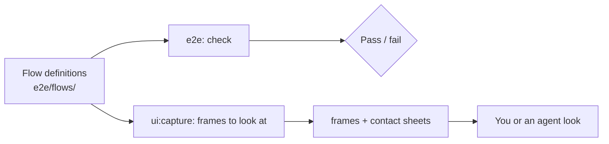

# Browser gate

The browser gate runs both reference hosts, the [showcase](../apps/showcase/README.md) and the [Next host](../apps/next-host/README.md), in real Chromium. Every test starts from seeded data and a fixed clock, and fails on any runtime error, hydration error, or request that leaves the host. The engine lives in [`@plainworks/testkit/browser`](../packages/testkit/README.md#browser-gate--plainworkstestkitbrowser).

## Quickstart

```bash
bunx turbo run build --filter=@plainworks/showcase^...   # the host's workspace dependencies
bunx playwright install chromium
bun run --filter @plainworks/showcase e2e                 # every flow and functional spec
```

Swap in `@plainworks/next-host` for the Next host. A failed test keeps its trace under the app's `test-results/`, and each failed checkpoint writes an evidence bundle under `.ui-artifacts/latest/`.

While you iterate, run only what you touched:

```bash
bun run --filter @plainworks/showcase e2e -- e2e/flows.spec.ts --grep "dialogs"   # one flow
bun run --filter @plainworks/showcase e2e -- e2e/journeys.spec.ts                 # one spec
```

To see what a change looks like, use [`ui:capture`](../packages/testkit/README.md#the-ui-loop--uicapture). It writes a frame at every checkpoint of the flows you name, for you or an agent to open and judge. `ui:capture --docs` refreshes the committed README screenshots from the checkpoints marked `docs`.

## The model



One set of flows feeds both uses: the e2e suite checks, and `ui:capture` shows.

- **Flows are the gate.** A flow is a named journey of checkpoints: the pages, states, overlays, dialogs, and gallery fixtures of an app. `flows.spec.ts` asserts every flow at the `quick` preset (desktop and mobile, light and dark), and a flow may add devices such as `tablet`, `reflow` (320 px), or `landscape`.
- **Functional specs cover the rest.** A journey that needs its own assertions, such as a mutation that reconciles through the server, stays a plain spec. It uses the app's `e2e/support/checks.ts` for a one-off axe, focus, or reflow check.
- **No screenshot baselines.** Every check is structural, so nothing is compared with a committed image and any machine gives the same verdict.

## What each checkpoint checks

| Check | Rule |
|---|---|
| **Runtime errors** | Any page error, `console.error`, failed request, hydration warning, or off-origin request fails. A test that provokes one on purpose allows that exact message. |
| **Axe** | No WCAG 2.2 AA violation on the whole page. |
| **Reflow** | No horizontal scrolling, and every open dialog, drawer, or menu fits the viewport. |
| **Focus** | Opt-in per checkpoint. The focused control shows at least a 2 px indicator and is not covered. |
| **Hydration** | React has hydrated the `main` landmark. |
| **Layout heuristics** | Clipped text, overlapping targets, focusable content hidden under fixed chrome, broken images, and layout shift. |

A checkpoint that provokes a finding on purpose lists it in `allow`, with a reason.

## How it runs in parallel

Each Playwright worker starts **its own host** on its own port and **signs in once**. Tests reset only their own worker's backend, so workers never step on each other. CI runs one job per app.

| | Showcase | Next host |
|---|---|---|
| Workers (local / CI) | half the cores / 2 | a quarter of the cores / 1 |
| Ports | `5199 + n` | `5299 + n` |
| Per-worker isolation | its own Vite dependency cache | its own `.next/e2e-<port>` output |
| Warm-up at start | one page render | one request per route |

Set `E2E_BASE_PORT` to move the port range, and pass `--workers` to change the worker count. A worker refuses a port another server already answers on, so stop a stale dev server first. Both hosts stay dev servers, because the development inspector is part of what the gate proves.

## Keep it deterministic

- **Data and time.** Each test resets its worker's mock backend. The host reads `PLAINWORKS_FIXED_NOW` to pin its clock, and the page's `Date` reads the same instant.
- **Environment.** The locale is `en-US`, the time zone is UTC, and motion is reduced.
- **Live updates.** A flow pauses a live feed before its first update.
- **No retries.** A flaky result is a defect to fix, not to retry.

## Add a flow

1. Add a module under the app's `e2e/flows/` with `defineFlow`. Give it `covers` globs, so `ui:capture --affected` selects it.
2. Each checkpoint has an `act` that drives the page (pass its `signal` to Playwright calls) and a `ready` locator. Open overlays from the keyboard (`pressWithKeyboard`) when the checkpoint checks focus.
3. Add the flow to the app's `e2e/flows/suite.ts`, then run it with `--grep "<flow name>"`.
