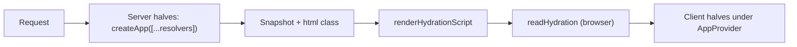

# @plainworks/app

> Composition kernel: wire the plainworks concern packages into a working app through an injected capability registry, host-neutral, no singletons.

Part of the [plainworks](../../README.md) kit.

## Install

```sh
bun add @plainworks/app
```

## Entry points

| Entry | What it gives you | Key exports |
| --- | --- | --- |
| `.` | The kernel: build the app, order capabilities, resolve the snapshot. Runs anywhere. | `createApp`, `defineCapability`, `AppSnapshot`, `AppConfigError` |
| `./hydration` | Write the server's data into the page and read it back in the browser. | `renderHydrationScript`, `readHydration` |
| `./client` | The headless React binding. DOM-free, so it runs on React Native too. | `AppProvider`, `defineProvider`, `useAppSnapshot`, `AppErrorBoundary` |
| `./capabilities/theme` | Server-resolved theme with no flash, plus the motion preference. | `createThemeResolver`, `createThemeCapability`, `createMotionCapability`, `useMotion` |
| `./capabilities/auth` | Server-resolved sign-in state with no flash. | `createAuthResolver`, `createAuthCapability` |
| `./capabilities/query`, `./capabilities/http`, `./capabilities/state` | Provide a query client, HTTP client, or state scopes. | `createQueryCapability`, `createHttpCapability`, `createScopesCapability` |
| `./testing` | Render a subtree inside real providers. | `renderWithProviders` |

## Quickstart

A capability has **two halves joined by an id**. The **server half** (a resolver) reads the request and returns a small JSON slice. The **client half** (a provider) mounts React context from that slice. The recipes give you both halves for the common concerns.



*The server resolves once; the browser's first render matches it.*

On the server, resolve the request and write the result into the page:

```ts
import { createApp } from "@plainworks/app"
import { createAuthResolver } from "@plainworks/app/capabilities/auth"
import { createThemeResolver } from "@plainworks/app/capabilities/theme"
import { renderHydrationScript } from "@plainworks/app/hydration"

const app = createApp({
  capabilities: [
    createThemeResolver({ cookie: "theme" }),
    createAuthResolver({ read: (cookie) => serverSession.read(cookie) }),
  ],
})
const snapshot = await app.resolve({ headers: request.headers, signal })

// Write this on <html class="..."> — the first paint already has the right theme.
const htmlClass = app.htmlClass(snapshot)
// Put this in the page. It is a JSON data block, so a strict CSP needs no nonce for it.
const hydration = renderHydrationScript({ snapshot, query: dehydrateClient(queryClient) })
```

In the browser, read it back and mount the client halves:

```tsx
"use client"
import { AppProvider } from "@plainworks/app/client"
import { createAuthCapability } from "@plainworks/app/capabilities/auth"
import { createHttpCapability } from "@plainworks/app/capabilities/http"
import { createQueryCapability } from "@plainworks/app/capabilities/query"
import { createThemeCapability } from "@plainworks/app/capabilities/theme"
import { readHydration } from "@plainworks/app/hydration"

const { snapshot, query } = readHydration(document)
const capabilities = [
  createQueryCapability({ client: queryClient }),
  createHttpCapability({ client: httpClient }),
  createThemeCapability({ source: themeSource }),
  createAuthCapability({ session }),
]

hydrateRoot(root, (
  <AppProvider capabilities={capabilities} snapshot={snapshot}>
    <Routes />
  </AppProvider>
))
```

`readHydration` validates what it reads and throws an `AppConfigError` on a missing or malformed block. With React Server Components you can skip the script entirely: pass `snapshot` from the server layout to the client `AppProvider` as a prop.

## How it composes

- **One factory, no singletons.** `createApp` builds a fresh app per request, so concurrent renders never share state. Nothing is read from a global.
- **Dependency order, not array order.** A provider lists the ids it `dependsOn` and mounts inside them. A duplicate, missing, or cyclic id is an `AppConfigError` before any render.
- **Server code stays server-side.** Resolvers are React-free. A recipe subpath exports its resolver from a neutral module and its provider from a `"use client"` module, so a server imports the resolver without pulling in the client graph.
- **Slices are untrusted.** A provider receives its slice as `unknown` and must validate it. The recipes do this for you.
- **Capabilities are the only extension point.** State scopes, the query client, and the HTTP client are capabilities too, not special options on `createApp`.

### Write your own capability

Author the server half with `defineCapability` and the client half with `defineProvider`, joined by the same `id`:

```ts
// locale.ts — server half, React-free
import { defineCapability } from "@plainworks/app"

export const localeResolver = defineCapability<string>({
  id: "locale",
  resolve: ({ headers }) => headers.get("accept-language")?.split(",")[0] ?? "en",
  htmlClass: (locale) => `locale-${locale}`,
})
```

```tsx
// locale.client.tsx — client half
"use client"
import { defineProvider } from "@plainworks/app/client"

export const localeProvider = defineProvider({
  id: "locale",
  provider: ({ resolved, children }) => (
    <LocaleProvider locale={typeof resolved === "string" ? resolved : "en"}>{children}</LocaleProvider>
  ),
})
```

Read the whole snapshot with `useAppSnapshot`, and catch render failures with `AppErrorBoundary` (injected fallback and report function).

### Handle remote failures once

`createFailureHandler` accepts the same `RemoteFailure` from HTTP, RPC, or a form. Localize by semantic reason or application code, then fall back to the server message. Supply a dedicated unauthenticated handler rather than retrying credentials.

```ts
import { createFailureHandler } from "@plainworks/app"

const handleFailure = createFailureHandler({
  messages: { SERVICE_UNAVAILABLE: "Try again later." },
  reasons: { QUOTA_EXCEEDED: "Your quota is used up." },
  onFailure: ({ message }) => showNotice(message),
  onUnauthenticated: () => showSignIn(),
})
```

Pass this handler to `Form.onFailure` and your typed query/action boundary. It never retries or invents a session-refresh protocol.

### Recipes are ejectable

Each recipe is thin glue over the owning package's public binding. `createQueryCapability` wraps `QueryProvider`, `createHttpCapability` wraps `HttpClientProvider`, `createAuthCapability` wraps your `createSessionContext` provider, and `createThemeCapability` wraps `ThemeProvider`. Delete `app`, mount those bindings yourself, and you lose only convenience. Each recipe is its own subpath and its owner is an optional peer, so an auth-only app never loads query or theme.

| Tier | What you use | When |
| --- | --- | --- |
| **1 — primitives** | each package alone (`state`, `query`, `auth`, `channel`) with its own provider | no `app` needed |
| **2 — kernel** | `createApp` + your own capabilities | you want one place to compose concerns |
| **3 — recipes** | `@plainworks/app/capabilities/*` | the common concerns in a line each |

### Testing

`renderWithProviders` renders a subtree inside the real providers. Pass the client halves and an optional snapshot:

```tsx
import { renderWithProviders } from "@plainworks/app/testing"

renderWithProviders(<Dashboard />, { capabilities: [localeProvider] })
```

## Runtime primitives

`@plainworks/app` is a **neutral (`.`)** package touching no host globals, so it runs on every target runtime. The neutral half uses only **universal** WHATWG value types directly — `Headers` (the resolve context's request headers) and `AbortSignal` (snapshot resolution is bounded by a caller-owned signal via `raceAbort` from `@plainworks/std/resilience`). It binds **no non-universal seam** of its own: `fetch`, storage, and crypto belong to the concern packages a capability wraps, never to the kernel. The `./client` bindings are DOM-free (the **React-without-DOM** bucket), so they also run on React Native/Expo. See [`docs/architecture.md › Runtime primitives`](../../docs/architecture.md#runtime-primitives) for the primitive contract and the three entry buckets.
