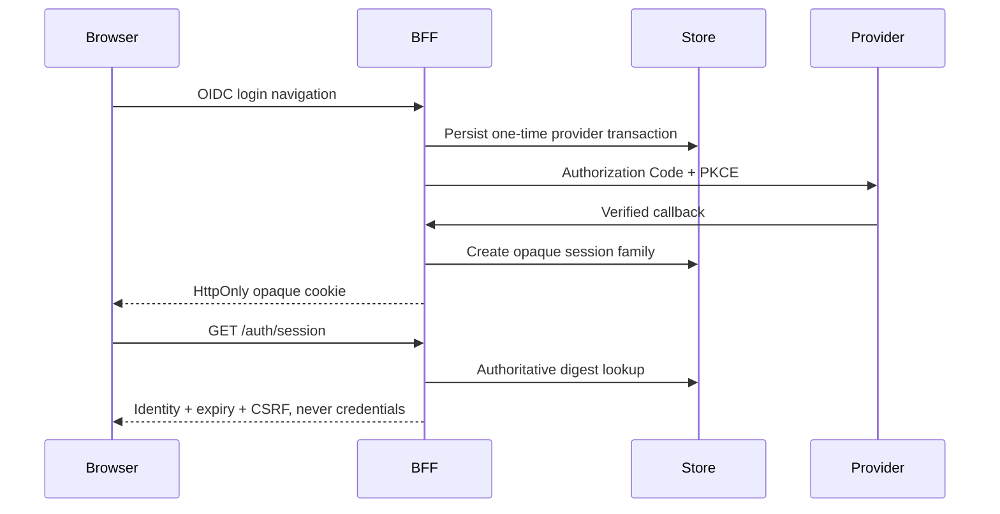

# @plainworks/auth

Opaque browser sessions, server-only OIDC credentials, and default-deny authorization.

## Connect a browser to a session host

```sh
bun add @plainworks/auth @plainworks/http
```

```ts
import { createAuthStore } from "@plainworks/auth/session"
import { createHttpClient } from "@plainworks/http"

const session = createAuthStore()
const protectedHttp = createHttpClient({
  baseUrl: "https://app.example.test/api", // Use the host's actual same-origin API.
  protectedSession: session.protectedSession,
})

await session.login({ username: "ada", password: "example-password" })
const snapshot = session.getSnapshot()
await session.logout()
session.close()
```

The browser never receives access tokens, refresh tokens, or the session credential. It retains only the published identity, expiry and CSRF proof. The HttpOnly cookie is sent by the browser itself; there is no token store, refresh endpoint or signed identity-cookie API.

### Session protocol

The browser speaks the published gokit session contract directly, without application role conversion:

| Operation | Contract | Budget |
|---|---|---|
| Login | `POST /auth/login`, JSON `{ username, password }`; successful session response | 5 seconds |
| Status | `GET /auth/session`; successful session response, no cookie renewal | 1 second |
| Logout | `POST /auth/logout`, `X-CSRF-Token`; `204` on confirmed revocation | 2 seconds, including CSRF preparation |

The response is `{ status: "authenticated", identity, expiresAt, csrfToken }`. `expiresAt` is RFC3339 with at most one hour remaining. Identity carries `subject`, `kind: "user" | "service"`, and either `{ mode: "unrestricted" }` or `{ mode: "restricted", resources, scopes }`; empty restriction arrays remain restrictive. Optional claims are application data, not a replacement authorization model.

The credential is exactly `__Host-session`: 32 cryptographically random bytes encoded as 43 canonical base64url characters, with `HttpOnly; Secure; SameSite=Strict; Path=/` and no Domain. JavaScript cannot read it. CSRF travels in a header, not a cookie reader, form logout or query parameter.

### Lifecycle and cancellation

`createAuthStore({ fetch?, baseUrl?, clock?, delay?, initialSnapshot? })` exposes `getSnapshot`, `subscribe`, `login`, `confirm`, `revalidate`, `logout`, `getAuthHeader`, `protectedSession` and `close`. `confirm` checks a signed-in seed without requesting status for a signed-out seed. `close` stops owned work without ending the store, so a root owner can call it on every teardown. `getAuthHeader` supplies CSRF only.

Status checks are generation-fenced and single-flight. Login and logout serialize in a queue capped at 16 mutations. Cancelling a caller stops its wait, not proof that the server mutation did not commit; a queued logout cannot overtake login. Each active mutation owns its request deadline. `close` cancels owned work and expiry timers.

Expiry, terminal authentication failure and operational status failure immediately cancel protected lifetimes and settle unauthenticated. Reconnect checks status before opening another protected stream; it does not refresh credentials. After local teardown, automatic status cannot silently reacquire the session: explicit successful login starts a new generation.

Logout clears local identity and stops protected work immediately. `revocation: "unconfirmed"` means the server has not confirmed revocation; only successful `204` changes it to `"confirmed"`. Show this distinction rather than claiming the cookie was revoked or automatically navigating into another login.

## Protect HTTP, RPC and channels

Inject the same `session.protectedSession` into `createHttpClient`, `createRpcTransport`, and `createChannel`. The seam lives in `@plainworks/std`; transports never import auth. It owns cancellation through HTTP body decoding, RPC stream iteration and channel attempts. Existing finite channel retry/burst budgets remain authoritative, with one bounded status check before reconnect.

Keep genuinely public clients separate. Showcase protects its browser data requests with the shared session runtime. Next keeps its browser demo API public and enforces protected page access on the server.

## Compose an opaque BFF

`@plainworks/auth/server` provides session composition, bounded memory storage and the `OpaqueSessionStore<Value>` persistence contract. Inject the store, an adapter, a session schema, `toSessionValue` and `toIdentity` into `createServerSession`. Separate request-local handles must share the same authoritative records.

The required signer protects CSRF proofs and OIDC transactions, not identity cookies. `hmacSessionSigner` supplies the server-side HMAC implementation. Identity and provider credentials remain in server custody.

The memory default bounds physical generations/tombstones to 1024 and pending login transactions to 256, with no live-session eviction. Retained expired generations support logout only: reads and replacement reject them. Replacement preserves the family's absolute expiry. Production multi-instance hosts inject transactional persistence implementing these same rules, family revocation and one-time login transaction consumption. Store failure must reject, never masquerade as a missing session.

Only domain-separated credential digests are persisted. OIDC PKCE/provider transaction material stays server-side behind a separate opaque login cookie. Re-login uses compare-and-swap; an older generation can revoke its successor. Provider access/refresh tokens remain in server-only adapter custody, and `refreshProvider` preserves legitimate provider refresh without a browser refresh protocol. The standalone Next starter needs no Go service.



OIDC is server credential verification, not a second browser session model. The reference hosts retain their explicit OIDC sign-in navigation; `login({ username, password })` is for hosts exposing the published JSON login endpoint.

### Server boundary helpers

`createRequestJar` collects outbound cookies and rejects duplicate session cookies or unsupported browser credential headers. `isSameOriginRequest` protects unsafe methods. Use `verifyCsrf` for active-session writes: it rejects missing, expired or revoked sessions, and returns `false` only for a bad proof on a live session. Pass rejected session checks to `authFailureResponse` so terminal authentication returns `401/SESSION_INVALID`, not a permission failure. Use `verifyLogoutCsrf` for family revocation through a retained generation. `authFailureResponse` also reports `AUTH_STORE_UNAVAILABLE` without exposing causes or credentials.

`redirectToPath` sanitizes same-origin return paths, `redirectToUrl` accepts trusted provider URLs, and `readFormBody` bounds OIDC navigation forms to 16 KiB.

## React and authorization

`@plainworks/auth/client` exposes `createSessionContext`, `SessionProvider`, `useSession`, `useIdentity`, `useIsAuthenticated`, `useSessionRuntime`, `useSessionOwner`, auth gates and injected login navigation. The browser root creates one runtime and calls `useSessionOwner(runtime)`, which confirms a signed-in seed against authoritative status after hydration (a signed-out seed is already the server's answer) and closes on teardown. Session expiry is measured on the server's clock, so browser clock skew never ends or extends a session. `SessionProvider` and protected transports only borrow that runtime; unmounting them never ends it. SSR identity seeds rendering, never certifies protected work.

`createAllowListPolicy`, `requireClaim` and `guardDecision` remain default-deny authorization helpers. Client gates are presentation only; enforce policy and credential restrictions server-side.

All neutral entries use injected structural Web primitives. `./client` is React but DOM-free; `./form-post` supplies browser sign-in navigation only; `./server` must never enter a client graph. Stateless JWT and API-key verifiers remain explicit registry adapters in `./adapter`. See [architecture](../../docs/architecture.md) for runtime and dependency boundaries.
