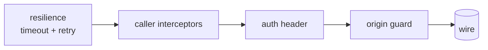

# @plainworks/connect

> Host-independent Connect-RPC (Connect-ES v2) integration — a transport factory with `std`-powered timeout/retry and header-only auth, a typed `RpcError` boundary mapper, and neutral connect-query key/invalidation conventions, plus a thin `./client` entry for the React hooks.

Part of the [plainworks](../../README.md) kit.

## Install

```sh
bun add @plainworks/connect
```

`@tanstack/query-core` is a required peer; `react`, `react-dom`, and `@tanstack/react-query` are optional peers, needed only for the `./client` hooks.

## Runtime primitives

`connect` is split across two entries. The neutral **`.`** entry (transport factory, interceptors, typed error, query bindings) names no DOM or Node global — it builds on `@connectrpc/connect-web` (plain `fetch`) and `@connectrpc/connect-query-core` (React-free), so it runs on server, edge, workers, RSC, and React Native. The **`./client`** entry is per-module `"use client"` and re-exports the connect-query React hooks; it is never the default import.

`fetch` is an **injected seam** (`options.fetch`, typed as the `std` `WebFetch` contract) that defaults to the host's platform `fetch` — pass a `WebFetch` wrapper for tests or custom credentials rather than a raw DOM `fetch`.

## Quickstart

```ts
import { createConnectRpcTransport } from "@plainworks/connect"
import { createClient } from "@connectrpc/connect"
import { EchoService } from "./gen/echo_pb" // your generated service

const transport = createConnectRpcTransport({
  baseUrl: "https://api.example.com",
  authProvider: async () => ({ Authorization: `Bearer ${await token()}` }),
  timeoutMs: 30_000,
  retry: { maxAttempts: 3, backoff: { baseMs: 200, maxMs: 5_000, factor: 2, jitter: "full" } },
})

const client = createClient(EchoService, transport)
const { message } = await client.echo({ message: "ping" })
```

`createConnectRpcTransport` is a **factory**, never a module-level singleton — build one per request/context and provide it through React context (`TransportProvider`), so nothing leaks across SSR requests.

## Transport & protocol

| `protocol` | Wire | When |
|---|---|---|
| `"connect"` (default) | Connect protocol over plain `fetch` (JSON or binary) | No proxy; directly browser-consumable. |
| `"grpc-web"` | gRPC-Web | A backend fronted by a gRPC-Web proxy (e.g. Envoy). |

Native gRPC (`@connectrpc/connect-node`, HTTP/2) is **deliberately not here**: it is Node-only and would pull `node:http2` into the neutral entry, breaking host-independence. If a real need appears it belongs in a separate Node-only entry that reuses the same interceptor chain.

The wire format defaults to JSON (`useBinaryFormat: false`) for debuggability; set `true` for binary protobuf on hot paths.

## Resilience & interceptor order

Every **unary** call is bounded by a per-attempt `std` timeout, and — when a `retry` policy is set — driven through bounded, jittered, **idempotent-only** backoff. All of it comes from `@plainworks/std`; connect forks no resilience logic. Idempotency is **derived from the method's proto declaration** (`idempotency_level = NO_SIDE_EFFECTS`/`IDEMPOTENT`), never a caller flag — so a write is never auto-retried, even after a partial success. A **streaming** call is not retried (a stream is neither safely re-consumable nor bounded by a single deadline), but its output is bounded by an **idle timeout**: if the server sends no message for `timeoutMs`, the underlying stream is aborted and the call fails `deadline_exceeded`, so a stalled stream never stays open indefinitely.

The chain runs **outermost → innermost**: `resilience → your interceptors → auth → origin guard`. The innermost guard is bound to `baseUrl` and refuses to send a credential to a different origin than the transport targeted, so an interceptor that rewrote the URL across origins can never exfiltrate the injected credential.



Resilience is outermost so the retry loop **re-runs the whole chain** — auth injection included — on every attempt: a refreshed credential is re-applied on a retry, and the attempt's abort signal is handed to the auth provider so an abandoned token refresh is cancelled with the request. Auth is **header-only** — a token never lands in a URL.

The per-attempt timeout uses `std` `withTimeout`, **not** Connect's `defaultTimeoutMs` (which is created once and shared across a retry loop, so a retry would inherit an already-elapsed budget).

## Error mapping — at the boundary only

Interceptors surface `ConnectError` (Connect's contract). Map it to the kit's typed `RpcError` with `mapConnectError` **where the consumer reads the failure** — a query error boundary or a `catch` site — never inside an interceptor, because Connect re-normalizes any interceptor-thrown value back into a `ConnectError` and would discard a custom type.

```ts
import { mapConnectError, isRpcError } from "@plainworks/connect"

try {
  await client.echo({ message: "ping" })
} catch (reason) {
  const error = mapConnectError(reason)
  if (error.code === "unavailable") retryLater()
}
```

`RpcError` extends `PlainError`, so its `kind` is `connect/${code}` (e.g. `connect/not_found`) — the same shape every plainworks package uses — while `code` exposes the bare Connect code for switch-on-code handling, and the originating `ConnectError` is preserved as `cause`.

> **connect-n2** — `RpcError.details` are **raw and undecoded**. Connect ships server error details as opaque `Any` payloads; the kit does not eagerly decode them (that needs the caller's message registry). Decode them yourself where you know the expected type.

## Query conventions

The neutral bindings re-export connect-query-core (keys, options, invalidation) plus two kit conveniences:

- **`createQueryKey({ schema, input, transport? })`** — a finite-cardinality, deterministic key for a unary method. Equal `schema` + `input` produce deeply-equal keys.
- **`createInvalidator(queryClient)`** — a method-scoped invalidation helper for mutations; the key is built with `cardinality: undefined` so it prefix-matches **both** finite and infinite queries for the method. React-free — it takes any `@tanstack/query-core` `QueryClient`, so it works in an RSC/server action.

> **connect-n1** — keys are **transport-scoped**. A hand-built key **must thread the same `transport`** the connect-query hooks use, or it will not match a hook-generated cache entry.

### React hooks (`./client`)

```tsx
"use client"
import { TransportProvider, useQuery } from "@plainworks/connect/client"

function Echo() {
  const { data } = useQuery(EchoService.method.echo, { message: "ping" })
  return <output>{data?.message}</output>
}
// Wrap with <TransportProvider transport={transport}> and TanStack Query's <QueryClientProvider>.
```

`TransportProvider` is connect-query's own DI context — provide the kit's transport through it, never a module-level client.

## Testing

Test your Connect usage network-free with [`@plainworks/testkit/connect`](../testkit/README.md#connect-testing----plainworkstestkitconnect): an in-memory `createFakeConnectTransport` (built on Connect's own `createRouterTransport`), a shared `EchoService` fixture, and interceptor request builders.

```ts
import { createFakeConnectTransport, EchoService } from "@plainworks/testkit/connect"
import { createClient } from "@connectrpc/connect"

const fake = createFakeConnectTransport(EchoService).unary(
  EchoService.method.echo,
  () => ({ message: "pong" }),
)
const client = createClient(EchoService, fake.transport)
```

The fixture's proto is the source of truth (`packages/testkit/proto/…/echo.proto`); regenerate the checked-in `*_pb.ts` with `bun run gen:proto` (dev-only buf + `protoc-gen-es` — build, typecheck, and test never need buf).
