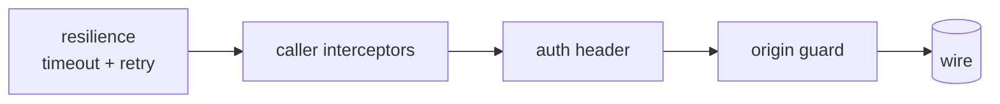

# @plainworks/connect

> Host-independent Connect-RPC with typed remote failures, bounded retries, descriptor-driven forms, and Query bindings.

Part of the [plainworks](../../README.md) kit.

## Install

```sh
bun add @plainworks/connect
```

`@tanstack/query-core` is a required peer; `react`, `react-dom`, and `@tanstack/react-query` are optional peers, needed only for the `./client` hooks.

## Runtime primitives

`connect` has one entry per concern. Only `./client` touches React.

| Entry | What it holds |
|---|---|
| `.` | The transport factory and the typed `RpcError`. |
| `./interceptor` | The resilience and auth interceptors. |
| `./query` | Query keys, query options, and method-scoped invalidation. |
| `./client` | The connect-query React hooks and `TransportProvider` (`"use client"`). |
| `./forms` | `createProtobufForm`: generated request descriptors and real Protovalidate rules. |
| `./testing` | Serialized adversarial failures and their expected classifications. |

The non-client entries name no DOM or Node global. They build on `@connectrpc/connect-web` (plain `fetch`) and `@connectrpc/connect-query-core` (React-free), so they run on server, edge, workers, RSC, and React Native.

`fetch` is an **injected seam** (`options.fetch`, typed as the `std` `WebFetch` contract) that defaults to the host's platform `fetch` — pass a `WebFetch` wrapper for tests or custom credentials rather than a raw DOM `fetch`.

## Quickstart

```ts
import { createConnectRpcTransport } from "@plainworks/connect"
import { createClient } from "@connectrpc/connect"
import { EchoService } from "./gen/echo_pb" // your generated service

const transport = createConnectRpcTransport({
  baseUrl: "https://api.example.com",
  authProvider: async () => ({ Authorization: `Bearer ${await token()}` }),
  timeoutMs: 30_000,
  retry: { maxAttempts: 3, backoff: { baseMs: 200, maxMs: 5_000, factor: 2, jitter: "full" } },
})

const client = createClient(EchoService, transport)
const { message } = await client.echo({ message: "ping" })
```

`createConnectRpcTransport` is a **factory**, never a module-level singleton — build one per request/context and provide it through React context (`TransportProvider`), so nothing leaks across SSR requests.

## Transport & protocol

| `protocol` | Wire | When |
|---|---|---|
| `"connect"` (default) | Connect protocol over plain `fetch` (JSON or binary) | No proxy; directly browser-consumable. |
| `"grpc-web"` | gRPC-Web | A backend fronted by a gRPC-Web proxy (e.g. Envoy). |

Native gRPC (`@connectrpc/connect-node`, HTTP/2) is **deliberately not here**: it is Node-only and would pull `node:http2` into the neutral entry, breaking host-independence. If a real need appears it belongs in a separate Node-only entry that reuses the same interceptor chain.

The wire format defaults to JSON (`useBinaryFormat: false`) for debuggability; set `true` for binary protobuf on hot paths.

## Resilience & interceptor order

Every **unary** call has a per-attempt timeout. Opt-in retries use bounded, jittered backoff and derive idempotency from the method's proto declaration (`NO_SIDE_EFFECTS`/`IDEMPOTENT`). The total `retry.budgetMs` includes admission, attempts, and waits; it defaults to 30 seconds. A server delay is a minimum, never shortened to `backoff.maxMs`. If it cannot fit the remaining budget, the call stops.

Streams never retry. `timeoutMs` bounds header arrival, then the gap between consumed messages, including time before the first pull. An idle stream aborts; iterator cleanup has a separate wait bounded by `timeoutMs`. Pull promptly or cancel explicitly.

The chain runs **outermost → innermost**: `resilience → your interceptors → auth → origin guard`. The innermost guard is bound to `baseUrl` and refuses to send a credential to a different origin than the transport targeted, so an interceptor that rewrote the URL across origins can never exfiltrate the injected credential.


```mermaid
flowchart LR
  R[resilience<br/>timeout + retry] --> C[caller interceptors] --> A[auth header] --> G[origin guard] --> W[(wire)]
```

Resilience is outermost so the retry loop **re-runs the whole chain** — header injection included — on every attempt. The attempt's signal bounds header acquisition; it does not authorize browser token refresh. For opaque sessions, inject `protectedSession` from `@plainworks/auth/session`: unary calls and streaming iteration borrow its cancellable lifetime and terminal authentication/store failures end protected work. Credentials never enter URLs; the browser sends its HttpOnly cookie and receives only CSRF headers.

The per-attempt timeout uses `std` `withTimeout`, **not** Connect's `defaultTimeoutMs` (which is created once and shared across a retry loop, so a retry would inherit an already-elapsed budget).

## Handle typed failures

The transport surfaces `RpcError` automatically, outside Connect's interceptor normalization. Its shared application `code` is separate from the string `rpcCode` and numeric `rawCode`. Standard binary `ErrorInfo`, `RetryInfo`, and `BadRequest` details supply the application identity, retry verdict, and violations. Unknown identities preserve protocol classification; malformed known details are operational failures, never field prompts.

```ts
import { isRpcError } from "@plainworks/connect"

try {
  await client.echo({ message: "ping" })
} catch (error) {
  if (!isRpcError(error)) throw error
  handleFailure(error) // createFailureHandler from @plainworks/app
}
```

`RpcError` and `HttpError` both extend `RemoteFailure` from `@plainworks/std/failure`. Handle them by `code` in one app boundary. `authentication === "unauthenticated"` is terminal: it does not authorize a refresh protocol or another generic retry. Original details, metadata, and cause remain available for diagnostics; do not log whole payloads.

## Query conventions

**Transport owns retries; Query owns caching and refetch.** The kit's `createQueryOptions`, `createInfiniteQueryOptions`, and all React hooks disable Query retries, even when the QueryClient defaults enable them. Use these options for imperative queries too; do not enable a second retry loop. Keys and protobuf structural sharing use connect-query-core.

- **`createQueryKey({ schema, input, transport? })`** builds a finite, deterministic key for a unary method. Equal `schema` and `input` give deeply equal keys.
- **`createMethodInvalidator(cache)`** invalidates a method's cached queries after a mutation, both finite and infinite. Pass `input` to narrow it and `signal` to cancel the refetches. It takes the `std` `CacheInvalidator` seam, so wire it to TanStack Query with `@plainworks/query/cache`:

```ts
import { createMethodInvalidator } from "@plainworks/connect/query"
import { createCacheInvalidator } from "@plainworks/query/cache"

const invalidate = createMethodInvalidator(createCacheInvalidator(queryClient))
await invalidate(EchoService.method.echo)
```

> **connect-n1** — keys are **transport-scoped**. A hand-built key **must thread the same `transport`** the connect-query hooks use, or it will not match a hook-generated cache entry.

### React hooks (`./client`)

```tsx
"use client"
import { TransportProvider, useQuery } from "@plainworks/connect/client"

function Echo() {
  const { data } = useQuery(EchoService.method.echo, { message: "ping" })
  return <output>{data?.message}</output>
}
// Wrap with <TransportProvider transport={transport}> and TanStack Query's <QueryClientProvider>.
```

`TransportProvider` is connect-query's own DI context — provide the kit's transport through it, never a module-level client.

## Testing

Test your Connect usage network-free with [`@plainworks/testkit/connect`](../testkit/README.md#connect-testing----plainworkstestkitconnect): an in-memory `createFakeConnectTransport` (built on Connect's own `createRouterTransport`), a shared `EchoService` fixture, and interceptor request builders.

```ts
import { createFakeConnectTransport, EchoService } from "@plainworks/testkit/connect"
import { createClient } from "@connectrpc/connect"

const fake = createFakeConnectTransport(EchoService).unary(
  EchoService.method.echo,
  () => ({ message: "pong" }),
)
const client = createClient(EchoService, fake.transport)
```

The fixture's proto is the source of truth (`packages/testkit/proto/…/echo.proto`); regenerate the checked-in `*_pb.ts` with `bun run gen:proto` (dev-only buf + `protoc-gen-es` — build, typecheck, and test never need buf).

## Protobuf forms

Create one `createProtobufForm(RequestSchema)` per form instance and pass it to `Form` from `@plainworks/ui/forms/form`. Use descriptor JSON names for controls: `label` for a custom JSON name, `primaryAddress.zip` for a nested field, and `addresses[0].zip` for a repeated message. The adapter translates server protobuf paths using that same descriptor, not string casing.

```tsx
const [schema] = useState(() => createProtobufForm(ProfileInputSchema))

<Form schema={schema} onSubmit={saveProfile} onFailure={handleFailure}>
  <TextField name="label" label="Name" />
  <TextField name="addresses[0].zip" label="Postal code" />
  <FormSubmit>Save</FormSubmit>
</Form>
```

Numbers, enums, timestamps, nested messages, and repeated controls decode before real Protovalidate runs. Blank optional numeric values stay absent; empty strings stay present. Cross-field rules use the summary. Invalid input is a field issue; validator compilation/evaluation failures remain operational. Controls and repeated items are each capped at 1,000, nesting at 32. Map controls are rejected explicitly.

The [showcase fixture](../../apps/showcase/e2e/fixtures/failures.tsx) is a complete composition. [Mocks](../mocks/README.md#wire-failure-fixtures) provides the pinned backend corpus; `createRpcFailureCases` and `connectFailureJson` from `./testing` add serialized malformed, reordered, foreign, and descriptor-path cases.
