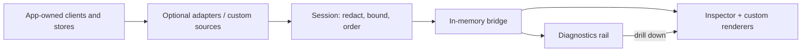

# @plainworks/devtools

> Development-only, host-independent runtime inspector with a neutral serializable session protocol.

Part of the [plainworks](../../README.md) kit.

`@plainworks/devtools` gives you one place to watch a composed Plainworks runtime — requests, state, cache, channel status — without tying your app to a browser extension, a dev server, or one host. You mount the inspector with the **sources** you care about — each one describing what can be observed — and it drives a bounded, redacted, serializable **session** behind the panel.

This entry (`.`) is host-independent: it touches no React, DOM, or host global, so it runs anywhere.

## Install

```sh
bun add @plainworks/devtools
```

## Quickstart

Put **all devtools imports, including instrumentation and CSS**, in a development-only module:

```ts
// devtools.ts
import "@plainworks/devtools/styles.css"
import { mountDevtools } from "@plainworks/devtools/client"

export function startInspector(): () => void {
  const { dispose } = mountDevtools({
    sources: [
      {
        id: { kind: "host", instance: "browser" },
        label: "Browser runtime",
        connect(observer) {
          observer.indicate({
            id: "mode", label: "Runtime", value: "development", severity: "info",
            updatedAt: Date.now(), target: "host",
          })
          return { dispose() {} }
        },
      },
    ],
  })
  return dispose
}
```

`mountDevtools` owns the session it builds, so `dispose` releases the shell, every source, and the session in one call. It is idempotent — safe to wire to both HMR and your root teardown.

Load it after your browser root mounts. For **Vite**, keep the gate as a statement:

```ts
if (import.meta.env.DEV) {
  let active = true
  let stop: (() => void) | undefined
  import.meta.hot?.dispose(() => {
    active = false
    stop?.()
  })
  const { startInspector } = await import("./devtools")
  if (active) stop = startInspector()
  // Also call stop when the host root is torn down.
}
```

`styles.css` is **plain, precompiled CSS** — the host needs no Tailwind build. Every inspector rule and keyframe is scoped to the shell's `[data-plainworks-devtools]` root, so it never restyles your page. The inspector lives in your document, not a shadow root, so a page rule that targets it directly (for example a later, more specific, or `!important` rule) can still apply. Your `.dark`, theme, and density classes on `<html>` still apply. Production must remove the whole development module, not just hide its UI.

## One session, two views



*The rail and inspector read the same session; React renderers never enter the neutral protocol.*

`mountDevtools` creates an isolated React root. Reach for `DevtoolsShell` instead when the inspector must render inside an existing React tree; it takes a session you own and never disposes it, which is also the path for sharing one session across several views.

The shell is a **docked bar** at the bottom of the viewport — the diagnostics rail plus an **Inspect** button — and a **non-modal inspector** beside your app. The page stays usable while it is open: nothing is dimmed, blurred, or made inert. Escape or the close button hands focus back to the button, and **⌘/Ctrl+Shift+D** toggles it (`shortcut: null` disables that binding).

| Option | Default | Effect |
| --- | --- | --- |
| `dock` | `"auto"` | `"right"`, `"bottom"`, or `"auto"` — right from `48rem` wide, bottom below. |
| `reserveSpace` | `true` | Pads `<html>` so the chrome never covers your content or a focused control. |
| `renderers` | — | Kind-keyed custom panels. They render in a slot the package CSS leaves to your own styles. |

### Host space

The shell claims its space through attributes on `<html>` and publishes the result as custom properties:

| Property | Meaning |
| --- | --- |
| `--plainworks-devtools-inset-block-end` | Space taken at the bottom: the bar, plus a bottom-docked panel. |
| `--plainworks-devtools-inset-inline-end` | Space taken at the inline end by a side-docked panel. |

With `reserveSpace` on, these are added to your own `padding` and `scroll-padding` on `<html>`, which suits document-scrolling pages. If your layout is a fixed-height shell (for example `h-dvh` with its own scroller), pass `reserveSpace={false}` and apply the properties where your layout needs them. Mount one shell per document.

Give every source a stable **kind + instance** pair and a readable label. Multiple sources of one kind get an instance picker. Unknown kinds still receive a generic event/detail view. Source failures stay visible without disabling other sources.

## Framework gates and ownership

| Host | Build-time gate | Ownership |
| --- | --- | --- |
| Vite (including Vite-based hosts) | `if (import.meta.env.DEV)` around `import("./devtools")` | Construct instrumentation before the observed client; dispose on root teardown and HMR. |
| Next.js App Router | `process.env.NODE_ENV !== "production"` inside a client effect | Keep DOM/CSS imports in a dynamically loaded module. Construct pure interceptor seams beside the client, under the same gate. |
| Webpack | `process.env.NODE_ENV !== "production"` with Webpack's `mode: "production"` | Webpack substitutes the condition at build time. Keep the import inside that condition; no runtime environment fallback. |

For Next, the component can mount the quickstart's `startInspector` without doing DOM work during SSR:

```tsx
"use client"
import { useEffect } from "react"

export function Inspector() {
  useEffect(() => {
    if (process.env.NODE_ENV === "production") return
    let active = true
    let stop: (() => void) | undefined
    void import("./devtools").then(({ startInspector }) => {
      if (active) stop = startInspector()
    })
    return () => {
      active = false
      stop?.()
    }
  }, [])
  return null
}
```

Do not construct a second HTTP client, store, or query cache for inspection. Create adapter seams **before** constructing the real client, then pass their sources to the mount. See the Vite composition ([seams](../../apps/showcase/src/client/dev-tools/seams.ts) created before hydration, [mount](../../apps/showcase/src/client/dev-tools/mount.tsx) loaded after it) and [Next composition](../../apps/next-host/src/client/dev-tools/seams.ts) for working examples. Next inspects client-owned HTTP, cache, and channel activity, not RSC requests or server sessions.

Run `bun run check-production` in this repository to prove both adopters ship no devtools code. It runs a separate, source-mapped **analysis build**, so the deployable output never carries maps. The scan reads each chunk's **source map**, so it catches a leaked adapter even after minification strips every telltale string. A script without a map fails unless the host lists it as a bundler runtime, manifest, or prebuilt polyfill; those and CSS are checked for devtools markers. Each host lists sources that must appear in the maps, so a build that stops emitting maps fails instead of passing blind. Re-run the check when changing gates, imports, or bundlers.

## Optional adapters (`./query`, `./state`, `./http`, `./connect`, `./channel`, `./observability`)

First-party adapters are imported only for the capabilities you use — an app that never imports them ships no adapter code:

```ts
import { createQuerySource } from "@plainworks/devtools/query"
import { createStateSource } from "@plainworks/devtools/state"

mountDevtools({
  sources: [
    createQuerySource({ client: queryClient, instance: "main" }),
    createStateSource({ store: cartStore, instance: "cart", snapshot: (s) => ({ items: s.items }) }),
  ],
})
```

Both are read-only views over public seams. The **query adapter** emits fetch/success/error lifecycle events and an aggregate health indicator (tracked/failing/fetching counts) without serializing the cache; one query's full state loads on demand. For deep cache and mutation inspection, render the maintained TanStack Query devtools as a custom panel beside it — Plainworks deliberately does not ship a competing cache inspector:

```tsx
import { ReactQueryDevtoolsPanel } from "@tanstack/react-query-devtools"

mountDevtools({
  sources,
  renderers: {
    query: () => (
      <QueryClientProvider client={queryClient}>
        <ReactQueryDevtoolsPanel />
      </QueryClientProvider>
    ),
  },
})
```

The **state adapter** shows bounded change summaries (which top-level keys changed, derived from the projected state, never raw or unwhitelisted values) and loads the full projected snapshot on demand. It is **private by default**: `snapshot` is required, so only the fields you whitelist at the boundary are ever summarized, retained, or forwarded — return the whole state (`(s) => s`) only when every field is safe to inspect. The **query adapter** projects keys safely via `keyLabel` and references queries with opaque internal identifiers so query keys and credentials never leak into event labels or detail tokens. Both adapters require an explicit `instance` label so multiple clients and stores never collide, and both honor the session's sanitize bounds — tokens, functions, and cycles never reach the panel. A source that recovers from a transient read/projection failure clears its failed state on the next healthy cycle rather than staying marked as failed.

### Runtime-flow adapters (`./http`, `./connect`, `./channel`, `./observability`)

These watch data in motion. Each returns the seam to hand your runtime — an interceptor, an options wrapper, or a sink — *plus* the source to register, so instrumentation is added beside your real client and observed without changing its behavior.

```ts
import { createHttpSource } from "@plainworks/devtools/http"
import { createConnectSource } from "@plainworks/devtools/connect"
import { createHttpClient } from "@plainworks/http"

const http = createHttpSource({ instance: "api" })
const client = createHttpClient({ interceptors: [http.interceptor] })

const connect = createConnectSource({ instance: "rpc" })
// hand connect.interceptor to your transport, then mount both sources
mountDevtools({ sources: [http.source, connect.source] })
```

| Adapter | Wire this seam | Safe data captured |
| --- | --- | --- |
| **HTTP** | Add `interceptor` to `createHttpClient`. | Method, sanitized URL, duration, status, and outcome. Headers require an explicit `captureHeaders` allowlist. |
| **Connect** | Add `interceptor` to the transport. | Service, method, duration, outcome, typed failure code, and streaming message counts. |
| **Channel** | Apply `instrument(options)` and call `observe(channel)`. | Status, reconnect count, frame count, last-event ID, and `{ type, bytes, id? }` frame metadata. Frame data never crosses the boundary. |
| **Observability** | Register the log sink, reporter backend, and vital reporter beside the operational pipeline. | Already-redacted log metadata, reports, and Web Vitals. Log fields require an explicit allowlist. |

HTTP and Connect use the same `ok` / `error` / `timeout` / `canceled` outcomes. Their rail indicator reads `N requests · F failed · K in flight`; it turns red on an error and recovers on the next success. Every adapter requires an explicit `instance`, isolates devtools failures from the application path, and coalesces high-frequency events with a bounded interval.

## Custom sources and commands

Implement `Source.connect(observer, signal)` beside the runtime it observes. Publish allowlisted summaries with `emit`, current health with `indicate`, and source failures with `fail`; call `recover` after a healthy read. Return a handle with `dispose` and, when needed, `resolveDetail` and `runCommand`. Abort work when `signal` aborts and release subscriptions on disposal.

Declare commands with an ID, label, availability, and risk (`safe`, `mutating`, or `destructive`). Validate command inputs inside the handler. The generic panel separates mutations and confirms destructive actions; **custom renderers must provide their own confirmation** and forward an abort signal to `port.runCommand`.

Pass a kind-keyed `renderers` map to the shell. A renderer receives `SourcePanelProps` with the selected instance, events, indicators, failure, and port. It is styled by **your** CSS (it renders in a slot the package stylesheet skips), and it still inherits the kit theme tokens from the inspector. The [showcase mock source](../../apps/showcase/src/client/dev-tools/mock-source.ts) and [mock panel](../../apps/showcase/src/client/dev-tools/mock-panel.tsx) demonstrate allowlisted probes, latency/error controls, and a confirmed reset. Neither fixture knowledge nor components belong in the package's neutral protocol.

## What the session guarantees

- **Serializable and versioned.** Every message carries a protocol version and contains only JSON-safe values — no functions, class instances, or cycles reach a consumer.
- **Private by default.** First-party adapters omit credentials and bodies by default. Custom sources must whitelist safe fields; session redaction and size limits are defense in depth, not a way to make arbitrary payloads safe.
- **Bounded.** Per-source and aggregate history are fixed-capacity rings that drop the oldest entry and report the loss. High-frequency sources can wrap their emit with `createEventSampler` to coalesce or sample a burst before it reaches the ring.
- **Cancellable and owned.** Detail and command requests are cancellable and superseded cleanly; disposing the session releases every source, pending request, subscription, and buffer.
- **Read-only by default.** A source exposes a command only by opting in with a descriptor and a handler; the protocol never carries an executable callback.

The session defaults to 200 retained events per source and 500 aggregate events. The live UI independently retains at most 500 events; resuming a paused timeline reloads the session's bounded replay. Call the mount's `dispose` and unsubscribe any observation you own outside the session. `DevtoolsShell` never disposes a session it did not build.

## Available and deferred

| Capability | Embedded v1 | Not included |
| --- | --- | --- |
| Query / state | Named instances, health, bounded changes, on-demand projected values | State editing, time travel; deep Query inspection belongs to TanStack's tools |
| HTTP / RPC / channel | Metadata timelines, outcomes, lifecycle, drops | Packet capture, arbitrary payload browsing |
| Observability | Tee existing redacted logs, reports, and Web Vitals | A production telemetry pipeline |
| App extensions | Explicit source and renderer injection, risk-tagged commands | Global plugin registry, arbitrary endpoint console |
| Other contexts | Neutral protocol and injectable bridge contract | Cross-tab transport, server/RSC inspection, browser extension, standalone viewer, React Native renderer |
| Auth / UI | Use existing auth diagnostics, React DevTools, and browser accessibility tools | Auth panel, token/claim inspection, component-tree tooling |

## Troubleshooting

| Symptom | Check |
| --- | --- |
| No sources or missing requests | Register the source for the actual instance. HTTP/RPC interceptors must be installed before constructing the client. |
| Duplicate registration error | Each kind/instance pair must be unique within a session. Tear down the old registration before replacing it. |
| Failed or stale rail indicator | Inspect the source panel; fix the upstream read and call `recover`. Freshness is based on the source's `updatedAt`. |
| Missing history after resume | Retention is bounded. Inspect dropped counts; pause affects presentation, not collection. |
| Unstyled inspector | Import `@plainworks/devtools/styles.css` from the gated module. No Tailwind setup is needed. |
| Inspector covers content | Keep `reserveSpace` on, or apply `--plainworks-devtools-inset-*` inside your own full-height layout. |
| Devtools in production output | Gate the source factories and CSS too. Use `NODE_ENV=production` for Vite build fixtures; `--mode production` alone need not disable `DEV`. Inspect emitted artifacts rather than relying on a hidden launcher. |
| Leaks after navigation or HMR | Call the mount's `dispose`; also release adapter observations you own outside the session, such as `channel.observe`. |

## Runtime primitives

`@plainworks/devtools` is a **neutral (`.`)** package. It uses only the **universal** `AbortController` / `AbortSignal` value primitives directly and depends on no non-universal seam, so it runs on every target runtime (Node, edge, workers, RSC, React Native). The transport to the client is an injected `Bridge`; the default is a host-free in-memory bridge. The interactive inspector lives behind the **DOM (`./client`)** entry and is never the default import. See [`docs/architecture.md › Axis 2`](../../docs/architecture.md) for the primitive contract and the three entry buckets.
