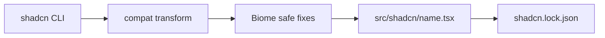

# `@plainworks/elements`

The shadcn/Base-UI atom set — buttons, inputs, dialogs, menus, and the rest of the ~47 primitives — installed and refreshed through the official **shadcn CLI**, never hand-copied or hand-edited. Every atom is a `"use client"` module with a per-atom subpath export, so consumers tree-shake to exactly the atoms they import.

Part of the [plainworks](../../README.md) kit.

## Quickstart

Import this package's stylesheet once — it pulls in the `@plainworks/theme` substrate and registers the shipped atoms as a Tailwind `@source` — then adopt the atoms you use:

```css
@import "@plainworks/elements/styles.css";
```

```tsx
import { Button } from "@plainworks/elements/button"
import { Card, CardContent, CardHeader, CardTitle } from "@plainworks/elements/card"
import { Input } from "@plainworks/elements/input"

export function ProfileForm() {
  return (
    <Card aria-labelledby="profile-title">
      <CardHeader>
        <CardTitle id="profile-title">Profile</CardTitle>
      </CardHeader>
      <CardContent>
        <label htmlFor="display-name">Display name</label>
        <Input id="display-name" />
        <Button>Save</Button>
      </CardContent>
    </Card>
  )
}
```

Tokens, color schemes, and the stylesheet are owned by [`@plainworks/theme`](../theme/README.md); every atom styles against theme semantic tokens and imports `cn` from it. The neutral `.` entry ships only the server-safe `ELEMENT_NAMES` manifest — the atoms themselves are DOM behaviour and live behind their subpaths.

## Two folders

| Folder | What lives there | Who edits it |
|---|---|---|
| `src/shadcn/` | **Vendored** atoms, exactly as the shadcn CLI produces them, **locked** by `shadcn.lock.json`. | Only the pipeline. |
| `src/atoms/` | Primitives we write ourselves (today, the theme-aware `sonner` Toaster). | Us, under the full lint and type rules. |

Both publish under the same `@plainworks/elements/<name>` subpath, and a name may live in only one folder.

## The ingestion pipeline

Atoms come **from the tool, not from a source checkout**. The `registry` CLI wraps the official shadcn CLI, so `add`/`update` are reproducible.



| Command | What it does |
|---|---|
| `registry:add <atom>` | Run `shadcn add`, apply the compat transform and Biome safe fixes, write the atom, and lock it. |
| `registry:update <atom>` | Re-run the pipeline against current upstream, relock, and print a review diff. |
| `registry:diff <atom>` | Advisory: show the locked atom versus current upstream. |
| `registry:validate` | Offline check that `registry.json` is schema-correct, every file exists, and every atom matches its lock. |
| `registry:codegen` | Re-derive `registry.json`, the `exports` map, the tsdown entries, and the `.` manifest from disk. |

Run them with `bun run --filter @plainworks/elements <script>`.

The **compat transform** rewrites the `cn` import onto `@plainworks/theme` and guarantees a leading `"use client"` directive. Biome then applies only its safe fixes (import order, `import type`). Nothing else changes, so an atom stays byte-comparable with upstream.

### The lock

`shadcn.lock.json` records the CLI version, the style, and a hash of every vendored atom. `registry:validate` (and a test) fails on a hand edit, an unlocked atom, or a stale entry. To change an atom, run `registry:update`.

### Where a deviation goes

An atom is never edited. A needed change follows the **deviation ladder** and goes to the lowest rung that fixes it for everyone:

| Need | Place |
|---|---|
| Color, contrast, focus, radius | [`@plainworks/theme`](../theme/README.md) tokens and rules (including focus for atoms that leave a keyboard stop unmarked) |
| One usage's props or classes | The call site (`className`, `role`, an array `defaultValue`) |
| A reusable behavior or tone set | A wrapper in [`@plainworks/ui`](../ui/README.md) |

Don't re-add a variant upstream doesn't ship; build it as a `ui` wrapper. An upstream bug is fixed the same way and noted for upstream reporting.

### Type-checking vendored code

Upstream code does not meet the kit's strictest compiler flags. `tsconfig.shadcn.json` relaxes only `isolatedDeclarations`, `exactOptionalPropertyTypes`, and unused-symbol checks for `src/shadcn`, and the build emits declarations with `tsc`. Consumers type against the built declarations, never the source. Biome turns off the rules upstream code doesn't meet (`noDoubleEquals`, `noUnusedImports`, and a few a11y lint rules upstream markup trips) for that folder alone. The a11y bar is still proven by the tests below.

## Drift-proof by codegen

`registry.json`, the package `exports`, the tsdown `entry` map, and `src/registry.ts` are all generated from the atom files in both folders — nothing is hand-maintained. A test re-derives them and asserts the committed artifacts match. After adding or removing an atom, run `registry:codegen`.

## Accessibility

Each interactive atom carries a behavioral test with an axe assertion next to it, and the gallery test (`src/shadcn/gallery.test.tsx`) renders the family under `renderToStaticMarkup` to prove it is SSR-safe. A contract test (`src/theme-variables.test.ts`) checks that every raw CSS variable an atom reads is declared by the theme. Automation is a floor, not proof — the showcase browser gate (`apps/showcase/e2e/atoms.spec.ts`) also checks contrast, target size, visible focus, reflow, and reduced motion on real layout.
