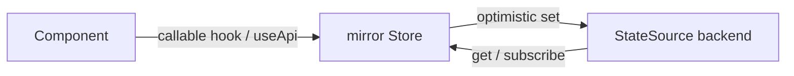

# @plainworks/state

> Engine-neutral client-state seam with a built-in default store and pluggable scopes (memory, storage, cookie, URL), SSR/RSC-safe by construction.

Part of the [plainworks](../../README.md) kit.

## Install

```sh
bun add @plainworks/state
```

## Runtime primitives

The neutral `.` core (`createStore` and the facade) touches **no** host primitives at all — it is pure state, so it runs on every target runtime (server, edge, workers, RSC, browser, React Native). The `./client` bindings are the **React-without-DOM** bucket: the scoped-state hooks use React (`useSyncExternalStore`) only and reference no `document` / `window` / `localStorage`, so they run in a browser and under React Native / Expo alike. The host-backed **scope backends** that *do* touch the DOM (`persistentScope`, `sessionScope`, `cookieScope`, `urlScope`) live at the separate DOM-only `@plainworks/state/client/scope` subpath, so importing the hooks never drags a browser global into a native bundle. See [`docs/architecture.md › Axis 2`](../../docs/architecture.md) for the three entry buckets.

## Server-safe core (`.`)

`createStore` is a **factory**, never a module-level singleton — every call returns an isolated store, so nothing leaks across SSR requests. The returned `Store` is a plainworks-owned type: the underlying engine (Zustand's vanilla core by default) never appears in the public contract, so it can change without a breaking change and your code stays decoupled from it. The store is usable outside React.

```ts
import { createStore } from "@plainworks/state"

const store = createStore<{ count: number; inc: () => void }>((set) => ({
  count: 0,
  inc: () => set((state) => ({ count: state.count + 1 })),
}))
```

### Ergonomics facade

`defineStore` composes an initializer from separate `state` and `actions`, and `createSelector` is a memoized derived selector — the combiner re-runs only when an input changes (compared with `Object.is`), so a derived object keeps a stable reference and re-renders a consumer only when it actually changes.

```ts
import { createSelector, defineStore } from "@plainworks/state"

const cart = defineStore<{ items: number[] }, { add: (n: number) => void }>({
  state: { items: [] },
  actions: (set) => ({ add: (n) => set((s) => ({ items: [...s.items, n] })) }),
})

const total = createSelector([(s: { items: number[] }) => s.items], (items) =>
  items.reduce((a, b) => a + b, 0),
)
```

### Bring your own store

The React binding drives React's own `useSyncExternalStore` over the owned `Store` seam, so any store — a hand-rolled one, or one you already run (MobX, valtio, …) — works as long as it implements `Store` (`getState`/`getInitialState`/`setState`/`subscribe`). Pass it to the Provider with `store={...}` (see below). For a raw `useSyncExternalStore` consumer, `toAdapter` bridges a `Store` into the `StateAdapter` (`subscribe`/`getSnapshot`/`getServerSnapshot`) shape for a selected slice.

## Client bindings (`./client`, `"use client"`)

`createStoreContext` returns a `Provider` plus selector hooks. The Provider builds the store once per mount (`useRef`), so two concurrent SSR requests each get an isolated store; `initialState` is the server → client hydration path.

In an RSC host (Next.js, TanStack Start), the module that calls the hooks needs the directive:

```tsx
"use client"

import { createStoreContext } from "@plainworks/state/client"

const { Provider, useStore } = createStoreContext<{ count: number; inc: () => void }>((set) => ({
  count: 0,
  inc: () => set((state) => ({ count: state.count + 1 })),
}))

function Counter() {
  const count = useStore((state) => state.count)
  const inc = useStore((state) => state.inc)
  return <button type="button" onClick={inc}>count: {count}</button>
}

// Hydrate from server-computed state:
// <Provider initialState={{ count: serverCount }}><Counter /></Provider>
```

`initialState` is shallow-merged over the initializer's state — right for plain-record state. For a non-record shape (array, class instance) or a deep merge, pass `mergeInitialState: (initial, serverState) => state` in the `createStoreContext` options so hydration preserves the shape.

To supply your own store engine, import from the engine-free `./client/supplied` subpath and pass a per-request `store`. This subpath loads **no** default engine — nothing pulls Zustand into your graph, even in a native-ESM host without tree-shaking:

```tsx
import { createSuppliedStoreContext } from "@plainworks/state/client/supplied"

const { Provider, useStore } = createSuppliedStoreContext<{ user: string }>()
// <Provider store={myStore}><Profile /></Provider>  — the `store` prop is required
```

## Scoped state (`./client`, `"use client"`)

A **scope** answers *where a value lives* — in memory, `localStorage`, a cookie, the URL. `createScopedState` binds one value to one scope and returns a **callable `use`-prefixed hook** — the binding *is* the subscribing hook, exactly like Zustand's `create`. Relocating the value is a **single `scope:` change**, never a call-site rewrite:

```tsx
"use client"

import { createScopedState } from "@plainworks/state/client"
import { persistentScope } from "@plainworks/state/client/scope"

const useTheme = createScopedState<"light" | "dark">({
  scope: persistentScope, // memoryScope is server-safe from "@plainworks/state"; the rest live in /client/scope
  key: "theme",
  initial: "light",
})

function ThemeToggle() {
  const value = useTheme() // read — Zustand muscle memory (or useTheme((v) => v) for a slice)
  const api = useTheme.useApi() // get / set / remove / subscribe
  return (
    <button type="button" onClick={() => api.set(value === "dark" ? "light" : "dark")}>
      theme: {value}
    </button>
  )
}
// <useTheme.Provider><ThemeToggle /></useTheme.Provider>
```

The only difference from Zustand's `create` is `useTheme.Provider` — the per-request boundary that keeps two concurrent SSR requests isolated (Zustand prescribes this same pattern for Next.js):

| Zustand                                    | plainworks                                          |
| ------------------------------------------ | --------------------------------------------------- |
| `const useStore = create((set) => ({...}))`| `const useTheme = createScopedState({...})`         |
| `useStore((s) => s.slice)`                 | `useTheme((s) => s.slice)`                           |
| `useStore.getState()`                      | `useTheme.useApi()` *(a hook — the instance is per-request)* |
| *(module singleton)*                       | `<useTheme.Provider>` *(per-request boundary)*      |

The Provider renders the seed first — matching the server, so **no hydration mismatch** — then reconciles against the backend in an effect on mount and stays in sync with external changes (another tab's write, a navigation, a remote push). The seed is the server/initial value, so the first client paint matches the server markup; a synchronous backend (Web Storage, cookie, URL) then reconciles immediately after mount, and an async/remote backend updates when it resolves. Reconciliation is **latest-wins and removal-aware**: an out-of-order read can't regress a newer value, and an external clear restores the initial. `set` is optimistic: the mirror updates immediately and a rejected persist is routed to `onError`, never swallowed. Pass an optional `actions: ({ set, get }) => ({...})` factory (the same shape as `defineStore`) to hang named actions on `useApi()`.

### One object, a scope per field

`createScopedObject` composes **one logical object whose fields each live in a different scope** — the theme in a cookie (the server needs it), the sidebar in `localStorage` (sticky, cross-tab), a draft in memory (ephemeral) — behind the same callable-hook shape:

```tsx
import { memoryScope } from "@plainworks/state" // server-safe scope
import { createScopedObject } from "@plainworks/state/client" // DOM-free hooks
import { cookieScope, persistentScope } from "@plainworks/state/client/scope" // DOM-only backends

export const usePrefs = createScopedObject({
  fields: {
    theme: { scope: cookieScope, initial: "system" },
    sidebar: { scope: persistentScope, initial: { collapsed: false } },
    draft: { scope: memoryScope, initial: "" },
  },
  actions: ({ set }) => ({
    toggleSidebar: () => set((s) => ({ sidebar: { collapsed: !s.sidebar.collapsed } })),
  }),
})

const theme = usePrefs((s) => s.theme) // read a slice
const { set, toggleSidebar } = usePrefs.useApi()
set({ theme: "dark" }) // patch — writes only the named field, to its own scope
```

Writes are **patch-only**: `set({ theme: "dark" })` touches just the `theme` field and fans it to its own scope; there is no whole-object replace (no cross-medium transaction to honor). A multi-field patch that partly fails raises a typed aggregate `StateSourceError` naming the failed field keys, each cause preserved — no swallowed error, no success-shaped partial write. Seed any subset for hydration with `<usePrefs.Provider initialValues={{ theme: cookieTheme }}>`.

### Security — the secret guard

A field may declare `sensitivity: "secret"`. The composer **rejects at construction** any secret placed in a scope that is not memory-equivalent (durable, sent to the server, or shared across tabs) — so a token can never land in `localStorage`, a cookie, or the URL. The guard is **capability-driven**, not a scope-name check. Secure token custody is `auth`'s job (a `__Host-` `HttpOnly` cookie); the in-memory `memory` scope is the only client-side fallback the guard allows.

Persisted media are **untrusted** — anyone can edit `localStorage`, a cookie, or the URL. Pass a Standard Schema validator as `schema` (on a `createScopedState` config or a per-field descriptor) to validate a decoded value at the read boundary; a tampered or wrong-shaped value becomes a typed `StateSourceError` (routed to `onError`) instead of a fabricated value, so the mirror falls back to `initial` rather than adopting garbage. The JSON serializer is a **syntax codec only** — it does not prove shape.

### The scopes

| Scope             | Backend          | Durable | Cross-tab | Sent to server | Notes                              |
| ----------------- | ---------------- | ------- | --------- | -------------- | ---------------------------------- |
| `memoryScope`     | in-memory store  | no      | no        | no             | server-safe; hydrates from SSR     |
| `persistentScope` | `localStorage`   | yes     | yes       | no             | non-secret only                    |
| `sessionScope`    | `sessionStorage` | yes     | no        | no             | per-tab                            |
| `cookieScope`     | `document.cookie`| yes     | no        | **yes**        | ~4 KB cap; non-secret only         |
| `urlScope`        | `?search` / `#`  | no      | no        | on navigation  | shareable, bookmarkable            |

**Never store a token or secret** in a client scope — every one is readable by any script on the origin, and a cookie is sent to the server on every request. The secret guard above enforces this structurally.

### The two seams

A scoped value is the composition of two seams: a `StateSource` **backend** (from `@plainworks/std`, *where the value lives*) feeding a mirror `Store` driven by the React **binding** (*what a component reads*).



Each host-backed scope takes an **injected host seam** with a platform default — `createWebStorageScope({ storage })`, `createCookieScope({ jar })`, `createUrlScope({ host })` — so a scope is tested without a browser, exactly as `http` injects `fetch`. Build a custom `StateSource` (or use `@plainworks/testkit`'s `fakeStateSource` / `asyncStateSource`) and wrap it in a `Scope` to back the same surface with anything.

