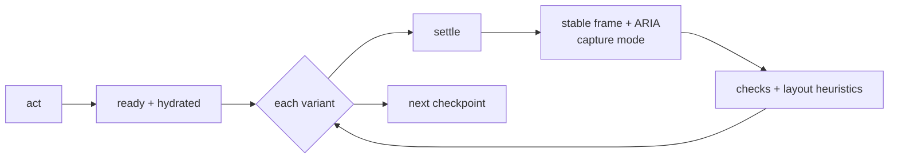

# @plainworks/testkit

> Shared, deterministic test harnesses and seam fakes for testing plainworks packages.

Client component tests import `renderA11y` and `expectNoAxeViolations` from `@plainworks/testkit/client`. The helper runs axe against the rendered container and reports rule identifiers for actionable failures.

Part of the [plainworks](../../README.md) kit.

## Install

```sh
bun add @plainworks/testkit
```

## Usage

```ts
import { ok } from "@plainworks/std"
import {
  manualClock,
  seededRandom,
  fakeAuthHeaderProvider,
  fakeSchema,
  guardSchema,
  createEmitter,
  recordEvents,
  expectOk,
  expectErr,
  deferred,
  flushMicrotasks,
} from "@plainworks/testkit"

// Deterministic time for anything built on the `Clock` seam.
const clock = manualClock(0)
clock.advance(1000)

// Seeded, reproducible randomness.
const rng = seededRandom(42)
rng.int(1, 6)

// Header-only auth double for the auth seam.
const auth = fakeAuthHeaderProvider({ headers: { Authorization: "Bearer test" } })

// A controllable Standard Schema for validated-boundary tests. `fakeSchema` drives accept /
// reject / transform directly; `guardSchema` builds one from a type-guard predicate.
const schema = guardSchema(
  (v): v is { id: string } =>
    typeof v === "object" && v !== null && typeof (v as { id?: unknown }).id === "string",
)

// Assert on a `Result` from `@plainworks/std`.
expectOk(ok(42)) // === 42; throws a typed PlainError on an Err
```

Server-safe only: this package pulls in no DOM or React code.

## Connect testing — `@plainworks/testkit/connect`

A network-free, host-independent subpath for testing Connect-RPC usage. It ships the shared proto fixture plus an in-memory transport built on Connect's own `createRouterTransport`, so a test drives real RPC wiring without a server. The Connect/protobuf libraries are **optional peer dependencies**, and the subpath is a separate tsdown entry — so non-Connect consumers of `@plainworks/testkit` neither install nor bundle them.

```ts
import {
  createFakeConnectTransport,
  EchoService,
  failUnary,
  Code,
} from "@plainworks/testkit/connect"

// Register canned responders, then hand `transport` to the code under test.
const fake = createFakeConnectTransport(EchoService)
  .unary(EchoService.method.echo, () => ({ message: "pong" }))
  .unary(EchoService.method.mutate, failUnary(Code.Unavailable))

const transport = fake.transport // built lazily on first read — register responders first

// Assert against recorded calls (method, wire headers, decoded input).
expect(fake.calls[0]?.header.get("authorization")).toBe("Bearer …")
```

- **`createFakeConnectTransport(service)`** — a `Transport` that routes to canned unary/streaming responders and records every call. A responder that must vary across attempts (fail-then-succeed for a retry test) is a stateful closure; a slow response awaits an injected `delay` inside the responder.
- **`failUnary(code, message?)`** — a responder that always fails with a typed `ConnectError`, for error-mapping and retry-classification tests.
- **Interceptor builders** — `fakeUnaryRequest` / `fakeUnaryResponse` / `fakeStreamRequest` drive an `Interceptor` directly (no transport) with a controllable `next`.
- **Shared fixture** — `EchoService` + typed `echoRequest`/`echoResponse`/`countRequest`/`countResponse` factories, generated from `proto/plainworks/testkit/v1/echo.proto`.

The proto is the source of truth; regenerate the checked-in `*_pb.ts` with `bun run gen:proto` (dev-only buf + `protoc-gen-es` — build, typecheck, and test never need buf).

## Browser gate — `@plainworks/testkit/browser`

The shared Playwright harness the reference hosts run, and the **flow engine** on top of it. Every test starts from a fixed "now", locale, and time zone, signs in once per worker, and fails on any runtime error, hydration error, or off-origin request. A flow then replays a journey and checks axe, reflow, overlays, focus, and layout at each checkpoint — no committed screenshots. `@playwright/test` and `@axe-core/playwright` are **optional peers**, loaded only by this subpath.

```ts
// playwright.config.ts: a fixed locale, time zone, and motion, plus strict screenshot defaults.
import { browserGateScreenshot, browserGateUse } from "@plainworks/testkit/browser"

export default defineConfig({
  fullyParallel: true,
  updateSnapshots: "none",
  expect: { toHaveScreenshot: browserGateScreenshot },
  use: { ...browserGateUse },
})
```

```ts
// A gated test: each worker starts its own host and signs in once, then resets the host per test.
import { BROWSER_GATE_NOW, createBrowserGate, FIXED_NOW_ENV } from "@plainworks/testkit/browser"

const test = createBrowserGate({
  host: {
    command: ["bun", "run", "server.ts"],
    basePort: 5199,
    readyPath: "/health",
    env: () => ({ [FIXED_NOW_ENV]: BROWSER_GATE_NOW, TZ: "UTC" }),
  },
  signIn: async (page) => {
    await page.goto("/login")
  },
  resetHost: async (request) => {
    await request.post("/mock/reset")
  },
})
```

| Export | What it gives you |
|---|---|
| `createBrowserGate` | The gated `test`: starts one host per worker (on `basePort + n`) and signs in once, then resets the host, pins `Date`, and fails on runtime errors. `runtimeErrors.allow(pattern)` accepts a failure the test provokes. |
| `browserGateUse` / `browserGateScreenshot` | The context and screenshot defaults for the Playwright config: fixed locale, time zone, and reduced motion; frozen animations and a strict pixel budget. |
| `VisualCapture` | Frames a checkpoint's screenshot: the `viewport`, or the `full-page` with the `position: fixed` chrome it names hidden, since Chromium would paint it mid-image. |
| `pressWithKeyboard` | Opens a control from the keyboard, so the overlay it opens shows focus as a keyboard user sees it. |

The host reads `PLAINWORKS_FIXED_NOW` to pin its own clock, so server-rendered and browser-rendered dates agree.

### Flows

A **flow** is a named journey of checkpoints on one live page. One definition runs as an end-to-end test (`assert`) and captures frames for review (`capture`). Each flow replays **once per device**. At every checkpoint it switches the page through each variant in place (mode, brand theme, density, and a preference such as forced colors or 200% text), then runs the checks.



```ts
// global-setup.ts: one run directory per invocation; the teardown writes report.json and report.md.
export default () => setupFlowRun({ root: ".ui-artifacts" })

// flows.spec.ts
const createTask = defineFlow({
  name: "create-task",
  // Repository globs this flow exercises; `ui:check --affected` maps changed files through them.
  covers: ["apps/web/src/tasks/**", "apps/web/e2e/flows/create-task.ts"],
  checkpoints: [
    { name: "board", act: (page) => page.goto("/tasks"), ready: (page) => page.getByRole("heading", { name: "Tasks" }) },
    { name: "new-task", act: (page, { signal }) => page.getByRole("button", { name: "New task" }).click({ signal }), ready: (page) => page.getByRole("dialog") },
  ],
})

// A plain `playwright test` asserts every flow at `quick`; `ui:check` picks flows, preset, and mode.
const suite = planFlowSuite([createTask], { axes })
for (const planned of suite.runs) {
  test.describe(planned.title, () => {
    test.use(planned.use)
    test("flow", ({ page, runtimeErrors }, testInfo) =>
      runFlow({ page, runtimeErrors }, planned, { mode: suite.mode, testInfo }),
    )
  })
}
```

| Export | What it gives you |
|---|---|
| `defineFlow` | Validates a flow. A checkpoint picks its checks, may `allow` a finding with a reason, and opts into a `pixel` baseline. Its `act` gets a `signal`: pass it to Playwright calls so a timed-out action stops. |
| `planFlowSuite` | The spec-side plan: every flow at `quick` in a plain run, or the flows, preset, and mode `ui:check` passes through the environment. |
| `planFlowRuns` | One test per flow × device for a matrix preset (`quick`, `devices`, `themes`, `a11y`, `full`) or a `MatrixSpec`. Big matrices sample pairwise. Every flow is validated, even one built without `defineFlow`. |
| `ThemeAxes` | Your theme vocabulary and how `<html>` renders it. For plainworks, build it from `@plainworks/theme`. Without it, flows vary light and dark only. |
| `runFlow` / `setupFlowRun` | Run a planned flow in a test, and manage the run directory around the whole invocation. A run no flow wrote to is removed. |
| `runFlowOnDevice` / `FlowSession` | The engine behind `runFlow`, driven through a page port you can fake. Each step's port call gets a signal that aborts when the step's budget runs out. |
| `FlowError` | Why a flow stopped: `action`, `readiness`, `unstable-frame`, `timeout`, `session`, `aborted`, or `failed` checks. |

A run lands in `<root>/runs/<id>/`, with `<root>/latest` pointing at the newest. Each failure gets an evidence bundle next to it: a frame, the ARIA tree, an inert DOM snapshot, and recent console and network entries. The snapshot has no scripts, redirects, or hidden and password values, and a policy that blocks script, so opening it never runs page code. Every page message is size-capped. When a bundle can't be collected, the report says why. Old runs are pruned: five runs, the current one included, within 1 GiB by default. Keep the root out of version control.

### The UI loop — `ui:check`

`ui:check` runs the flows, checks every checkpoint, and compares the frames with a baseline from the same machine. It prints one verdict and the report path. Wire it once per app:

```ts
// e2e/ui-check.ts, run with `bun e2e/ui-check.ts` (the showcase names it `ui:check`).
process.exitCode = await runUiCheckCli({ app: "@acme/web", appDir: "apps/web", root: ".ui-artifacts", spec: "e2e/flows.spec.ts", flows, axes, host, warmPort: 5190 })
```

The everyday loop on a UI change:

```bash
bun run ui:check --save-as before   # before you edit: save a baseline
# ...edit...
bun run ui:check --affected         # the flows your change touches, compared with "before"
```

| Flag | Effect |
|---|---|
| `--affected` | Only the flows whose `covers` match files changed since the merge-base with `origin/main`. A file no flow covers selects every flow (fail safe). The report says why each flow ran. |
| `--flow <a,b>` | Run the named flows. |
| `--preset <name>` | The matrix preset. Defaults to `quick`. |
| `--save-as <name>` | Keep this run as a named local snapshot. |
| `--base <snapshot or git ref>` | Compare with a snapshot, or with the merge-base of a git ref. Without it, a run compares with `before` when that snapshot exists. A git base is captured once from a worktree and cached by commit, flow source, and preset; the three most recent are kept. |
| `--no-diff` | Check only; skip the comparison. |

Exit codes: **0** when nothing failed, **1** when a check failed, **2** when the harness could not run (a usage error, a base that could not be captured, or a run that never finished). Visual changes never fail the run. They are listed in `report.md` under **Visual changes**, and `sheets/changed.png` shows each changed frame as before, after, and a highlighted diff. A frame counts as `removed` only when its flow ran cleanly; frames of a flow that errored or wasn't selected are `not captured`.

**Warm host.** `ui:check serve` starts the app once on `warmPort` and keeps it signed in, so later `ui:check` runs skip startup. Stop it with Ctrl-C. It also writes a [Playwright MCP](https://github.com/microsoft/playwright-mcp) config for exploring the same seeded, fixed-clock, signed-in app, and prints the command to start it. Don't explore while `ui:check` runs: the gate resets the demo data before each flow.

## Streaming transport double — `fakeStreamTransport`

A scripted `StreamTransportFactory` for testing anything built on the `@plainworks/std` stream seam — a channel, an app's live view, or an integration flow — without SSE or WebSocket sockets. You drive each connection attempt by hand: open it, push frames, then end it cleanly or with an error. It honors the abort seam like a real transport, so reconnect, resume-from-cursor, and teardown all exercise the same double.

```ts
import { fakeStreamTransport } from "@plainworks/testkit"

const transport = fakeStreamTransport()
const channel = createChannel({ transport: transport.factory /* ... */ })

const attempt = transport.current // the live attempt
attempt.open() // the consumer sees the stream open
attempt.frame({ data: "hello" }) // push a frame
attempt.endError(new Error("drop")) // or endOk() to close cleanly

// The consumer resumes with the last cursor it saw:
expect(transport.attempts[1]?.context.lastEventId).toBe("42")
transport.assertClosed() // throws if any attempt leaked (never torn down)
```

## OpenID Provider double — `createMockIdp`

A deterministic, in-process OpenID Provider for testing an OIDC adapter end to end. It mints **real, JWKS-verifiable** tokens with `jose`, so the adapter runs its genuine discovery, PKCE, nonce, and token-verification path — only the network is faked (no MSW, no sockets). It exposes the `fetch` seam the adapter consumes plus an `authorize` helper that stands in for the user-agent's visit to the authorization endpoint, and it drives the failure paths: `failNextTokenExchange`, replayed codes, PKCE-verifier mismatch, and `idTokenNonceOverride` for a replay test.

```ts
import { createMockIdp } from "@plainworks/testkit"

const idp = await createMockIdp({ claims: { email: "user@idp.test" } })
// Configure the adapter's `fetch` seam with `idp.fetch`, then, after building the authorization URL:
const { callbackUrl } = idp.authorize(authorizationUrl) // redirect-back URL with code + state
```
