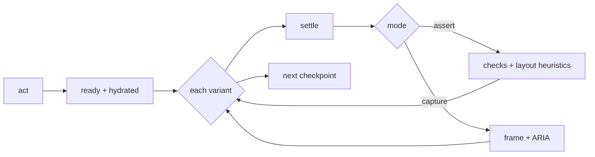

# @plainworks/testkit

> Shared, deterministic test harnesses and seam fakes for testing plainworks packages.

Client component tests import `renderA11y` and `expectNoAxeViolations` from `@plainworks/testkit/client`. The helper runs axe against the rendered container and reports rule identifiers for actionable failures.

Part of the [plainworks](../../README.md) kit.

## Install

```sh
bun add @plainworks/testkit
```

## Usage

```ts
import { ok } from "@plainworks/std"
import {
  manualClock,
  seededRandom,
  expectOk,
  expectErr,
  deferred,
  flushMicrotasks,
} from "@plainworks/testkit"
import {
  fakeAuthHeaderProvider,
  fakeSchema,
  guardSchema,
  recordEvents,
  recordTelemetry,
  fakeCacheInvalidator,
} from "@plainworks/testkit/fakes"

// Deterministic time for anything that takes a `clock?: Clock` option. Use std's `fixedClock`
// when time never needs to move.
const clock = manualClock(0)
clock.advance(1000)

// Seeded, reproducible randomness.
const rng = seededRandom(42)
rng.int(1, 6)

// Header-only auth double for the auth seam.
const auth = fakeAuthHeaderProvider({ headers: { Authorization: "Bearer test" } })

// A controllable Standard Schema for validated-boundary tests. `fakeSchema` drives accept /
// reject / transform directly; `guardSchema` builds one from a type-guard predicate.
const schema = guardSchema(
  (v): v is { id: string } =>
    typeof v === "object" && v !== null && typeof (v as { id?: unknown }).id === "string",
)

// Record what a transport reports through the telemetry seam.
const telemetry = recordTelemetry()
telemetry.records // [{ kind: "start", name: "http.client.request", ... }, ...]

// Assert which cache entries an invalidation marked stale.
const cache = fakeCacheInvalidator()
cache.seed(["users", 1])
await cache.invalidate({ key: ["users"] })
cache.isStale(["users", 1]) // true

// Assert on a `Result` from `@plainworks/std`.
expectOk(ok(42)) // === 42; throws a typed PlainError on an Err
```

The root and `./fakes` entries are server-safe. React and DOM helpers stay on their named subpaths.

## Query testing — `@plainworks/testkit/query`

Use one isolated query client per test. Retries are disabled unless the test opts back in.

```tsx
import { createQueryClient } from "@plainworks/query"
import { createTestQueryClient, TestQueryClientProvider } from "@plainworks/testkit/query"

const client = createTestQueryClient(createQueryClient)
render(
  <TestQueryClientProvider client={client}>
    <Tasks />
  </TestQueryClientProvider>,
)
```

## Connect testing — `@plainworks/testkit/connect`

A network-free, host-independent subpath for testing Connect-RPC usage. It ships the shared proto fixture plus an in-memory transport built on Connect's own `createRouterTransport`, so a test drives real RPC wiring without a server. The Connect/protobuf libraries are **optional peer dependencies**, and the subpath is a separate tsdown entry — so non-Connect consumers of `@plainworks/testkit` neither install nor bundle them.

```ts
import {
  createFakeConnectTransport,
  EchoService,
  failUnary,
  Code,
} from "@plainworks/testkit/connect"

// Register canned responders, then hand `transport` to the code under test.
const fake = createFakeConnectTransport(EchoService)
  .unary(EchoService.method.echo, () => ({ message: "pong" }))
  .unary(EchoService.method.mutate, failUnary(Code.Unavailable))

const transport = fake.transport // built lazily on first read — register responders first

// Assert against recorded calls (method, wire headers, decoded input).
expect(fake.calls[0]?.header.get("authorization")).toBe("Bearer …")
```

- **`createFakeConnectTransport(service)`** — a `Transport` that routes to canned unary/streaming responders and records every call. A responder that must vary across attempts (fail-then-succeed for a retry test) is a stateful closure; a slow response awaits an injected `delay` inside the responder.
- **`failUnary(code, message?)`** — a responder that always fails with a typed `ConnectError`, for error-mapping and retry-classification tests.
- **Interceptor builders** — `fakeUnaryRequest` / `fakeUnaryResponse` / `fakeStreamRequest` drive an `Interceptor` directly (no transport) with a controllable `next`.
- **Shared fixture** — `EchoService` + typed `echoRequest`/`echoResponse`/`countRequest`/`countResponse` factories, generated from `proto/plainworks/testkit/v1/echo.proto`.

The proto is the source of truth; regenerate the checked-in `*_pb.ts` with `bun run gen:proto` (dev-only buf + `protoc-gen-es` — build, typecheck, and test never need buf).

## Playwright gate — `@plainworks/testkit/playwright`

The shared Playwright harness the reference hosts run, and the **flow engine** on top of it. Each worker owns a host. Each test gets a fresh browser context, resets the backend, and only then signs in when configured. A fixed "now", locale, and time zone keep runs deterministic; runtime errors, hydration errors, and off-origin requests fail the test. Flows check axe, reflow, overlays, focus, and layout at each checkpoint, without committed screenshots. `@playwright/test` and `@axe-core/playwright` are **optional peers**, loaded only by this subpath.

```ts
// playwright.config.ts: a fixed locale, time zone, and motion.
import { browserGateUse } from "@plainworks/testkit/playwright"

export default defineConfig({
  fullyParallel: true,
  use: { ...browserGateUse },
})
```

```ts
// A public suite needs no sign-in. Each worker owns a host; each test resets its backend.
import { BROWSER_GATE_NOW, createBrowserGate, FIXED_NOW_ENV } from "@plainworks/testkit/playwright"

const test = createBrowserGate({
  host: {
    command: ["bun", "run", "server.ts"],
    basePort: 5199,
    readyPath: "/health",
    env: () => ({ [FIXED_NOW_ENV]: BROWSER_GATE_NOW, TZ: "UTC" }),
  },
  resetHost: async (request) => {
    const response = await request.post("/mock/reset", { timeout: 5_000 })
    if (!response.ok()) throw new Error("Host reset failed")
  },
})
```

| Export | What it gives you |
|---|---|
| `createBrowserGate` | The gated `test`: owns one host per worker (`basePort + n`), resets before per-test sign-in, pins `Date`, and watches runtime errors. `gateHost` exposes the owned lifecycle; `gateSignIn: false` selects a signed-out test. |
| `startGateHost` / `RunningGateHost` | Strict readiness and owned `stop()` / same-origin `restart()`, also usable outside a fixture. |
| `gateHostOrigin` | Resolves the same configured HTTP/HTTPS origin for startup, capture, and warm reuse. |
| `HostShutdownError` | Graceful shutdown failed. `released` distinguishes completed forced termination from cleanup still owned by the caller. Repeated stop preserves the failure without signalling a released process. |
| `HostStartupError` | Startup failed. `retained` says the process group is still alive and `host.stop()` is the retry owner; otherwise forced cleanup already released it. |
| `runOwnedCommand` | Runs one command in its own process group under a signal and always releases the group, keeping both the cancellation and any forced-cleanup failure. |
| `browserGateUse` | The context defaults for the Playwright config: fixed locale, time zone, and reduced motion. |
| `VisualCapture` | Frames a checkpoint's screenshot: the `viewport`, or the `full-page` with the `position: fixed` chrome it names hidden, since Chromium would paint it mid-image. |
| `pressWithKeyboard` | Opens a control from the keyboard, so the overlay it opens shows focus as a keyboard user sees it. |
| `focusWithKeyboard` | Focuses a control as keyboard focus arrives, so it shows its focus indicator even after a click. |

The host reads `PLAINWORKS_FIXED_NOW` to pin its own clock, so server-rendered and browser-rendered dates agree.

**Readiness and ownership.** Readiness requires exactly `readyStatus` (200 by default), never a redirect. Add `ready(response)` to validate the host's protocol and run/build identity. Startup, probes, and graceful stop default to 30 s, 1 s, and 10 s; forced settling gets 2 s and is reported as failure. Output retains at most 64 KiB per stream. Any occupied port is rejected, even if its listener returns 404. Commands run directly, without a shell, in a POSIX process group; they must keep descendants in that group rather than daemonize. Cleanup waits for both the root's output handles and its process group. `command` may be an argv factory receiving the same `{ port, origin }` as `env`, for hosts configured through flags.

**Sessions and reset.** Supply `signIn(page)` to complete a real UI login after reset. The gate rejects supplied `storageState` for session suites: a cookie saved before reset is not a valid session afterwards. `test.use({ gateSignIn: false })` starts signed out. `PLAINWORKS_GATE_ORIGIN` selects an explicitly external host and requires one worker; that fixture does not claim stop/restart ownership. `bun run e2e` drives the gate itself through the real Playwright runner and checks every worker's host is released after success, sign-in failure, assertion failure, timeout, and cancellation.

**Trusted HTTPS.** Set `origin: (port) => \`https://localhost:${port}\`` and install a test CA only in runner-owned trust stores. Set `NODE_EXTRA_CA_CERTS` before starting Node, and configure browser trust for the same CA. Keep keys and private fixture state outside reports. Never disable TLS checks. See the [browser gate guide](../../docs/browser-gate.md#real-system-hosts) for the disposable-container proof.

### Flows

A **flow** is a named journey of checkpoints on one live page. One definition runs two ways: `assert` checks every checkpoint as an end-to-end test, and `capture` writes a frame and an ARIA snapshot at every checkpoint for you to look at, with no checks. Each flow replays **once per device**. At every checkpoint it switches the page through each variant in place (mode, brand theme, density, and a preference such as forced colors or 200% text).



```ts
// global-setup.ts: one run directory per invocation; the teardown writes report.json and report.md.
export default () => setupFlowRun({ root: ".ui-artifacts" })

// flows.spec.ts
const createTask = defineFlow({
  name: "create-task",
  // Repository globs this flow exercises; `ui:capture --affected` maps changed files through them.
  covers: ["apps/web/src/tasks/**", "apps/web/e2e/flows/create-task.ts"],
  checkpoints: [
    { name: "board", act: (page) => page.goto("/tasks"), ready: (page) => page.getByRole("heading", { name: "Tasks" }) },
    { name: "new-task", act: (page, { signal }) => page.getByRole("button", { name: "New task" }).click({ signal }), ready: (page) => page.getByRole("dialog") },
  ],
})

// A plain `playwright test` asserts every flow at `quick`; `ui:capture` picks flows, preset, and mode.
const suite = planFlowSuite([createTask], { axes })
for (const planned of suite.runs) {
  test.describe(planned.title, () => {
    test.use(planned.use)
    test("flow", ({ page, runtimeErrors }, testInfo) =>
      runFlow({ page, runtimeErrors }, planned, { mode: suite.mode, testInfo }),
    )
  })
}
```

| Export | What it gives you |
|---|---|
| `defineFlow` | Validates a flow. `extraDevices` adds devices beyond the preset's, such as `landscape` for a tall dialog. A checkpoint picks its checks and may `allow` a finding with a reason. Its `act` gets a `signal`: pass it to Playwright calls so a timed-out action stops. |
| `planFlowSuite` | The spec-side plan: every flow at `quick` in a plain run, or the flows, preset, and mode `ui:capture` passes through the environment (`FLOW_SUITE_ENV`). |
| `planFlowRuns` | One test per flow × device for a matrix preset (`quick`, `devices`, `themes`, `a11y`, `full`) or a `MatrixSpec`. Big matrices sample pairwise. Every flow is validated, even one built without `defineFlow`. |
| `ThemeAxes` | Your theme vocabulary and how `<html>` renders it. For plainworks, build it from `@plainworks/theme`. Without it, flows vary light and dark only. |
| `runFlow` / `setupFlowRun` | Run a planned flow in a test, and manage the run directory around the whole invocation. A run no flow wrote to is removed. |
| `runFlowOnDevice` / `FlowSession` | The engine behind `runFlow`, driven through a page port you can fake. Each step's port call gets a signal that aborts when the step's budget runs out. |
| `FlowError` | Why a flow stopped: `action`, `readiness`, `timeout`, `session`, `aborted`, or `failed` checks. |

Nothing is compared with a committed screenshot: every check is structural, so any machine gives the same verdict.

A run lands in `<root>/runs/<id>/`, with `<root>/latest` pointing at the newest. Each failure gets an evidence bundle next to it: a frame, the ARIA tree, an inert DOM snapshot, and recent console and network entries. The snapshot has no scripts, redirects, or hidden and password values, and a policy that blocks script, so opening it never runs page code. Every page message is size-capped. When a bundle can't be collected, the report says why. Old runs are pruned: five runs, the current one included, within 1 GiB by default. Keep the root out of version control.

### The UI loop — `ui:capture`

`ui:capture` captures the flows you name as frames, so you or an agent can open them and judge the UI. It runs no checks (the e2e suite does), so a capture of one flow takes seconds. It can also show what changed against a saved snapshot or a git ref. Wire it once per app:

```ts
// e2e/ui-capture.ts, run with `bun e2e/ui-capture.ts` (the showcase names it `ui:capture`).
process.exitCode = await runUiCaptureCli({ app: "@acme/web", appDir: "apps/web", root: ".ui-artifacts", spec: "e2e/flows.spec.ts", flows, axes, host, warmPort: 5190 })
```

The everyday loop on a UI change:

```bash
bun run ui:capture --flow create-task   # frames of one flow; open them and look
# ...edit, capture again, look again...
```

When you want a diff, save a snapshot first and compare with it:

```bash
bun run ui:capture --flow create-task --save-as before
# ...edit...
bun run ui:capture --flow create-task --base before
```

| Flag | Effect |
|---|---|
| `--flow <a,b>` | Capture the named flows. Without it or `--affected`, every flow. |
| `--affected` | Only the flows whose `covers` match files changed since the merge-base with `origin/main`. A file no flow covers selects every flow (fail safe). The report says why each flow ran. |
| `--preset <name>` | The matrix preset. Defaults to `quick` (desktop and mobile, light and dark). |
| `--save-as <name>` | Keep this run as a named local snapshot. |
| `--base <snapshot or git ref>` | Also compare with a snapshot, or with the merge-base of a git ref. A git base is captured once from a worktree and cached by commit, flow source, and preset; the three most recent are kept. Without it, nothing is compared. |
| `--docs` | Refresh the app's docs images. Takes no other flag. See below. |

Frames land in the run's `flows/` folder, and `sheets/` holds one contact sheet per checkpoint with every variant side by side. With `--base`, `report.md` lists the **Visual changes**, and `sheets/changed.png` shows each changed frame as before, after, and a highlighted diff. A changed frame never fails the run.

**Docs images.** A README can show real screenshots that never go stale. Mark a checkpoint with `docs: "tasks-board"` and set `docsDir` in the config, such as `docs/images`. Then `ui:capture --docs` captures only the flows that mark images and copies each marked desktop frame to `<docsDir>/tasks-board-light.png` and `tasks-board-dark.png`. It deletes any other PNG in that folder, so the set always matches the marks. If a flow breaks, it writes nothing. Commit the folder, and rerun `--docs` when the UI changes. Nothing checks the images; the diff shows up in review. Embed a pair with `<picture>`, so the reader's color scheme picks the image:

```html
<picture>
  <source media="(prefers-color-scheme: dark)" srcset="docs/images/tasks-board-dark.png">
  
</picture>
```

Exit codes: **0** when every flow captured, **1** when a flow broke (it errored, raised a runtime error, or never hydrated), **2** when the harness could not run (a usage error, a base that could not be captured, or a run that never finished).

**Warm captures.** `ui:capture serve` owns a host on `warmPort`, so later single-worker captures skip startup. Every captured test still resets before signing in. Warm reuse uses the same strict readiness and configured HTTPS origin as owned startup. Stop it with Ctrl-C. A flow that stops/restarts its host needs its own fixture, not an external warm host.

**Isolated exploration.** `ui:capture serve --explore` owns a separate host on `explorePort` (`warmPort + 2` by default), never reused by captures. It writes a signed-out [Playwright MCP](https://github.com/microsoft/playwright-mcp) config and prints its command. Sign in interactively; no cookie or credential-bearing browser state is saved or passed to MCP. The host's state/fixture paths must also be isolated by port. Stop it with Ctrl-C.

## Streaming transport double — `fakeStreamTransport`

A scripted `StreamTransportFactory` for testing anything built on the `@plainworks/std/seam` stream seam — a channel, an app's live view, or an integration flow — without SSE or WebSocket sockets. You drive each connection attempt by hand: open it, push frames, then end it cleanly or with an error. It honors the abort seam like a real transport, so reconnect, resume-from-cursor, and teardown all exercise the same double.

```ts
import { fakeStreamTransport } from "@plainworks/testkit/fakes"

const transport = fakeStreamTransport()
const channel = createChannel({ transport: transport.factory /* ... */ })

const attempt = transport.current // the live attempt
attempt.open() // the consumer sees the stream open
attempt.frame({ data: "hello" }) // push a frame
attempt.endError(new Error("drop")) // or endOk() to close cleanly

// The consumer resumes with the last cursor it saw:
expect(transport.attempts[1]?.context.lastEventId).toBe("42")
transport.assertClosed() // throws if any attempt leaked (never torn down)
```
